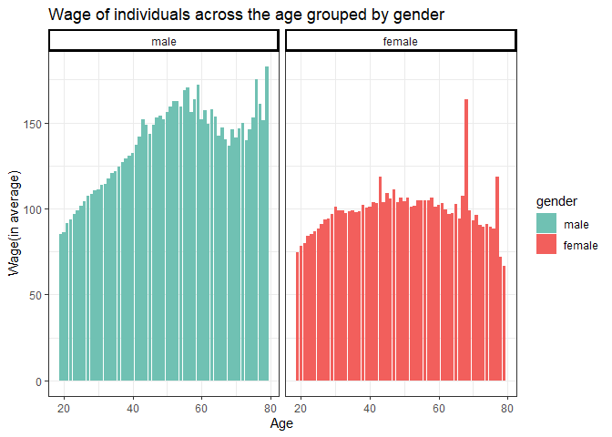

# 1. Wage overview in Italia
This question aims to answer the relationship between wage and age in Italy. Moreover, it also would like to discover if there is any difference of the relationship between male and female.

First, we need to import datasets from the console

```r
 ps1 = read_csv("./dataset/ps1.csv", 
                col_types = cols(log_dailywages = col_number()))
```

## (a) Data process


```r
dataset=ps1 %>%
  mutate(female = if_else(sex=="F",1,0),age=2001-birth)
```

## (b) Wage distribution against age

With the distribution, we can find the wage increases as age becomes larger. However, we can also find a decreasing marginal effect of age.


```r
wage_distribute= dataset %>%
  group_by(age) %>%
  # Use the raw data of wage to plot
  summarise(wage_avg=mean(exp(log_dailywages))) %>%
  ggplot(aes(x=age,y=wage_avg))+
  geom_bar(stat="identity",fill="red")+
  labs(title="Wage of individuals across the age")+
  labs(x="Age", y="Wage(in average)")+
  guides(colour=guide_legend(title.theme=NULL))+
  theme(legend.position = "bottom") + 
  theme_bw()
  

wage_distribute
```


## (c) Regression

With the wage vs age distribution, I use a regression to obtain an expectation wage condition on age, i.e. uses age as a predictor to estimate the expectation value of wage. Then, I look into the summary statistics of the coefficients of each age. As we can see, the effect of the age is different from 0.02 to 0.57 and the avarage effect of the age is 0.37 (log(wage)).


```r
dataset$age =as.factor(dataset$age)
model_1=lm(data = dataset, log_dailywages~age)
stargazer(model_1, type="html", style = "qje",
          omit        = "age",
          omit.labels = "Ommited Age Dummies")
```

```
## 
## <table style="text-align:center"><tr><td colspan="2" style="border-bottom: 1px solid black"></td></tr><tr><td style="text-align:left"></td><td>log_dailywages</td></tr>
## <tr><td colspan="2" style="border-bottom: 1px solid black"></td></tr><tr><td style="text-align:left">Constant</td><td>4.347<sup>***</sup></td></tr>
## <tr><td style="text-align:left"></td><td>(0.012)</td></tr>
## <tr><td style="text-align:left"></td><td></td></tr>
## <tr><td style="text-align:left">Ommited Age Dummies</td><td>Yes</td></tr>
## <tr><td style="text-align:left"><em>N</em></td><td>760,909</td></tr>
## <tr><td style="text-align:left">R<sup>2</sup></td><td>0.065</td></tr>
## <tr><td style="text-align:left">Adjusted R<sup>2</sup></td><td>0.065</td></tr>
## <tr><td style="text-align:left">Residual Std. Error</td><td>0.396 (df = 760848)</td></tr>
## <tr><td style="text-align:left">F Statistic</td><td>886.966<sup>***</sup> (df = 60; 760848)</td></tr>
## <tr><td colspan="2" style="border-bottom: 1px solid black"></td></tr><tr><td style="text-align:left"><em>Notes:</em></td><td style="text-align:right"><sup>***</sup>Significant at the 1 percent level.</td></tr>
## <tr><td style="text-align:left"></td><td style="text-align:right"><sup>**</sup>Significant at the 5 percent level.</td></tr>
## <tr><td style="text-align:left"></td><td style="text-align:right"><sup>*</sup>Significant at the 10 percent level.</td></tr>
## </table>
```

```r
model1coef<-model_1$coefficients
agedummies <- model1coef[(2:61)]
model.data1 <-data.frame(agedummies)
stargazer(model.data1, type="html", style="qje",
          title            = "Summary Age Dummies",
          summary.stat = c("n", "min","max","mean", "sd"))
```

```
## 
## <table style="text-align:center"><caption><strong>Summary Age Dummies</strong></caption>
## <tr><td colspan="6" style="border-bottom: 1px solid black"></td></tr><tr><td style="text-align:left">Statistic</td><td>N</td><td>Min</td><td>Max</td><td>Mean</td><td>St. Dev.</td></tr>
## <tr><td colspan="6" style="border-bottom: 1px solid black"></td></tr><tr><td style="text-align:left">agedummies</td><td>60</td><td>0.020</td><td>0.520</td><td>0.377</td><td>0.123</td></tr>
## <tr><td colspan="6" style="border-bottom: 1px solid black"></td></tr></table>
```

## (d) Male and Female wage distribution
Now, I look into the wage distributioni of male and female separately, then we can find the trends are somehow different, which means the relationships between age and wage are different within these two groups.

```r
gender_label = c('male', 'female')
names(gender_label) = c(0, 1)
# wage_male_distribute = 
  dataset %>%
  mutate(female = as.factor(female)) %>%
  # filter(female=="0") %>%
  group_by(age, female) %>%
  summarise(wage_avg=mean(exp(log_dailywages))) %>%
  ungroup() %>%
  ggplot(aes(x=as.integer(as.character(age)),y=wage_avg, fill = female))+
  geom_bar(stat="identity")+
  labs(title="Wage of individuals across the age grouped by gender")+
  labs(x="Age", y="Wage(in average)", fill = 'gender')+
  theme(legend.position = "bottom") + 
  facet_grid(~ female , labeller = labeller(female = gender_label)) + 
  scale_fill_manual(labels=c("male","female"), 
                    values = c('#70c1b3','#f25f5c'))+
  theme_bw() +
  theme(strip.background = element_rect(
     color="black", fill="transparent", size=1.5, linetype="solid"
     ))
```



<!-- ##(e) -->

<!-- ```{r} -->

<!-- model_2=lm(log_dailywages~age+female+female*age,data=dataset) -->
<!-- stargazer(model_2, type="text", style = "qje", -->
<!--           omit = "age", -->
<!--           omit.labels = "Omitted Age variables ") -->
<!-- model2coef<-model_2$coefficients -->
<!-- agedummies <- model2coef[(2:61)] -->
<!-- age.female <-model2coef[(63:122)] -->
<!-- model.data2 <-data.frame(agedummies, age.female) -->

<!-- stargazer(model.data2, type="text", style = "qje", -->
<!--           title            = "Summary Age Dummies", -->
<!--           summary.stat = c("n", "min","max","mean", "sd")) -->

<!-- ``` -->

## (e) Add the squared age variable
As we can see the decreasing positive correlation of age and wage, I add the squared term of age into the regression and the cofficients are significant.

```r
dataset$age = as.numeric(as.character(dataset$age))
model_3=lm(log_dailywages~female+age+I(age^2),data=dataset)
stargazer(model_3,type="text", style="qje",
          covariate.labels = c("female","age","$age^{2}$","intercept")
         )
```

```
## 
## ==========================================================
##                                 log_dailywages            
## ----------------------------------------------------------
## female                            -0.275***               
##                                    (0.001)                
##                                                           
## age                                0.034***               
##                                    (0.0002)               
##                                                           
## age2                              -0.0003***              
##                                   (0.00000)               
##                                                           
## intercept                          3.970***               
##                                    (0.005)                
##                                                           
## N                                  760,909                
## R2                                  0.166                 
## Adjusted R2                         0.166                 
## Residual Std. Error          0.374 (df = 760905)          
## F Statistic             50,464.010*** (df = 3; 760905)    
## ==========================================================
## Notes:              ***Significant at the 1 percent level.
##                      **Significant at the 5 percent level.
##                      *Significant at the 10 percent level.
```


##(f) Compare the prediction and true value of different gender

The prediction is very similar to the expectation value. However, when age increases, we can find that the conditional mean of male and femael start to diverse. Perhaps, we could also use an interaction term between female and the squared term of the age variable.


```r
df = dataset %>% 
  group_by(age,female) %>%
  summarise(avg_wage=mean(log_dailywages))


prediction=get_regression_points(model_3) %>%
  group_by(age,female) %>%
  summarise(avg_wage=mean(log_dailywages),wage_hat=mean(log_dailywages_hat))
  

ggplot(prediction,aes(x=age,shape=as.factor(female)))+
  geom_point(aes(y=avg_wage))+
  geom_smooth(aes(y=wage_hat,color=as.factor(female)))+
  geom_point(aes(y=wage_hat,color=as.factor(female)))+
  scale_shape_discrete(labels=c("male","female"))+
  scale_color_manual(labels=c("male","female"), 
                     values = c('#70c1b3','#f25f5c')) +
  theme(legend.title=element_blank())+
  labs(title="Prediction vs Conditioinal Mean")+
  labs(x="Age",y="wage(daily)")+
  theme(panel.border = element_blank()) + 
  guides(color = guide_legend("Prediction",
                              override.aes=list(fill=NA)), 
         shape = guide_legend("Conditional mean")) +
  theme_bw()
```

<!-- -->

# 2. Replication of Olken (2007)

Brief introduction: This paper tries to investigate if the treatments (audtion, invitation and comment) are effective to decrease corruption in Indonesia. The author used a randomized field experiment to test the treatment effect of each treatment. There are 6 (2*3) groups recieving various treatments  (control/audit X control/invite/comment) in the research. Also, the author hired a team to evaluate the expense of each items in the project, and, then, compared it with the expense from the projects' statement as the dependent variable (i.e. missing expense).

## (a) The assumption necessary to estimate the treatment effect
One of the most important assumption would be  SUTVA (Stable Unit Treatment Value Assumption), which means no spillover effect among controlled groups and treated groups. For example, for villages assigned to control group, they might hear the auditors went to other vaillages and therefore be aware of that and reduce the amount/probabilty of corruption. Olken use the distance to the nearest audit village to test if there is any spillover effect in the experiment, yet he suggests no impact of spillover effect.

```r
# Import the data
Olken <- read_dta("./dataset/Olken.dta")
# Tramsform the data
Olken=Olken %>%
  mutate(auditstratnum=factor(auditstratnum))
```

## (b)

These three table shows the relationship between village characteristic and treatments (audit, intivation and comment respectively). The author uses a probit model where the dependent variables are treatment dummies. The standard error is clustered at subdistrict level, which is consists of several villages. The reason for cluster is the villages in the same subdistrict are easily to be affected by the change in part of them. From the table, we can know most of the village characteristics do not siginifcantly affect the dummies and the coefficient is very small. On the other hand, we can use the t-test among groups to test if there is significant difference among groups. This step is important because it can help to check how the balance of the treatment assignment after the randomization.


```r
model1 <- probitmfx(audit_rand ~ 
              zpop + totalmesjid + totalallocation + z4RABnumsubproj
            + zpercentpoorpra + zdistancekec + zkadesedyears
            + zkadesage + zkadesbengkoktotal + podeszhill
            , data = Olken, clustervar1 = "kecid")

model2 <- probitmfx(und_rand ~ 
              zpop + totalmesjid + totalallocation + z4RABnumsubproj
            + zpercentpoorpra + zdistancekec + zkadesedyears
            + zkadesage + zkadesbengkoktotal + podeszhill
            , data = Olken
            , clustervar1 = "kecid")

data_cond <- Olken %>%
  filter(undfpm_rand == 1)

model3 <- probitmfx(fpm_rand ~ 
                    zpop + totalmesjid + totalallocation + z4RABnumsubproj
                  + zpercentpoorpra + zdistancekec + zkadesedyears
                  + zkadesage + zkadesbengkoktotal + podeszhill
                  , data = data_cond
                  , clustervar1 = "kecid")                          
stargazer(model1$mfxest, model2$mfxest, model3$mfxest, type = 'text', header = F)
```

```
## 
## ==================================================
##                    dF/dx  Std. Err.   z    P> | z|
## --------------------------------------------------
## zpop               -0.007   0.012   -0.525  0.599 
## totalmesjid        -0.018   0.038   -0.468  0.640 
## totalallocation    -0.001   0.001   -1.153  0.249 
## z4RABnumsubproj    -0.017   0.025   -0.672  0.502 
## zpercentpoorpra    0.246    0.128   1.929   0.054 
## zdistancekec       -0.001   0.006   -0.230  0.818 
## zkadesedyears      0.012    0.009   1.306   0.192 
## zkadesage          0.004    0.003   1.535   0.125 
## zkadesbengkoktotal 0.011    0.007   1.663   0.096 
## podeszhill         0.134    0.075   1.788   0.074 
## --------------------------------------------------
## 
## ==================================================
##                    dF/dx  Std. Err.   z    P> | z|
## --------------------------------------------------
## zpop               0.0005   0.007   0.071   0.943 
## totalmesjid        -0.008   0.022   -0.375  0.708 
## totalallocation    0.0001  0.0003   0.247   0.805 
## z4RABnumsubproj    0.013    0.014   0.939   0.348 
## zpercentpoorpra    0.015    0.090   0.162   0.872 
## zdistancekec       -0.002   0.005   -0.350  0.727 
## zkadesedyears      -0.012   0.008   -1.459  0.144 
## zkadesage          0.002    0.003   0.632   0.527 
## zkadesbengkoktotal -0.003   0.003   -0.959  0.338 
## podeszhill         -0.052   0.040   -1.314  0.189 
## --------------------------------------------------
## 
## ===================================================
##                     dF/dx  Std. Err.   z    P> | z|
## ---------------------------------------------------
## zpop                0.001    0.009   0.135   0.892 
## totalmesjid         0.012    0.028   0.424   0.672 
## totalallocation    -0.0001   0.001   -0.232  0.816 
## z4RABnumsubproj    -0.017    0.016   -1.055  0.292 
## zpercentpoorpra     0.033    0.112   0.291   0.771 
## zdistancekec        0.001    0.006   0.165   0.869 
## zkadesedyears       0.016    0.011   1.487   0.137 
## zkadesage          -0.0004   0.003   -0.129  0.897 
## zkadesbengkoktotal  0.006    0.004   1.602   0.109 
## podeszhill          0.077    0.050   1.564   0.118 
## ---------------------------------------------------
```


## (c) The effect of audit treatment

The table shows the treatment effect of audit treatment in different items and projects. I control other treatment and use the auditstratnum fixed effect. As the table shows, the coefficient of is negative in average, which means the aomunt of corruption of the auditted villages would be less, compared to the control village. However, only the effect is only significant when we include all the expense at once.


```r
model1 <- lm(lndiffeall3mat ~ audit_rand + undfpm_rand + fpm_rand + auditstratnum, data=Olken)
 
model2<-lm(lndiffeburuh ~ audit_rand + undfpm_rand + fpm_rand + auditstratnum , data=Olken)

model3<-lm(lndiffeall4 ~ audit_rand + undfpm_rand + fpm_rand + auditstratnum, data=Olken)

model4<-lm(lndiffeall4mainancil ~ audit_rand + undfpm_rand + fpm_rand
           , data=Olken)

stargazer(model1, model2, model3, model4, type="text",
          omit        = "auditstratnum",
          dep.var.labels = c('Missing $ in material', 'Missing $ in labor', 
                             'Missing $ in major item', 'Missing $ in all projects'),
          omit.labels = "Ommited Stratum Fix Effects")
```

```
## 
## ===========================================================================================================================
##                                                                   Dependent variable:                                      
##                             -----------------------------------------------------------------------------------------------
##                               Missing in material      Missing in labor      Missing in major item  Missing in all projects
##                                       (1)                     (2)                     (3)                     (4)          
## ---------------------------------------------------------------------------------------------------------------------------
## audit_rand                          -0.034                  -0.041                  -0.048                 -0.091***       
##                                     (0.033)                 (0.079)                 (0.029)                 (0.030)        
##                                                                                                                            
## undfpm_rand                          0.014                  -0.159*                 -0.020                  -0.030         
##                                     (0.038)                 (0.090)                 (0.034)                 (0.037)        
##                                                                                                                            
## fpm_rand                            -0.028                   0.039                   0.002                   0.003         
##                                     (0.038)                 (0.090)                 (0.033)                 (0.037)        
##                                                                                                                            
## Constant                             0.150                   0.032                   0.166                 0.310***        
##                                     (0.166)                 (0.429)                 (0.147)                 (0.029)        
##                                                                                                                            
## ---------------------------------------------------------------------------------------------------------------------------
## Ommited Stratum Fix Effects           Yes                     Yes                     Yes                     No           
## ---------------------------------------------------------------------------------------------------------------------------
## Observations                          477                     426                     477                     538          
## R2                                   0.375                   0.333                   0.351                   0.019         
## Adjusted R2                          0.299                   0.242                   0.271                   0.013         
## Residual Std. Error            0.331 (df = 424)        0.741 (df = 374)        0.293 (df = 424)        0.348 (df = 534)    
## F Statistic                 4.898*** (df = 52; 424) 3.662*** (df = 51; 374) 4.411*** (df = 52; 424)  3.373** (df = 3; 534) 
## ===========================================================================================================================
## Note:                                                                                           *p<0.1; **p<0.05; ***p<0.01
```


## (d)

Another interesing finding from Olken is that corruption still happend for villages certainly auditted. He thinks it's possible because of the law in Indonesia that managers is unlikely to be punished for corruption the amount of which is under USD 1,200. To test the idea, we create a new variable.


```r
Olken=Olken %>%
  mutate(corruption = lndiffeall4mainancil*totalprojusd) %>%
  mutate(realcorruption=corruption-1200) %>%
  mutate(true_realcorruption=if_else(realcorruption<0,0,realcorruption))
```

## (e) 

We can see the coefficient is far more larger and significant.


```r
model1 <- lm(true_realcorruption ~ audit_rand + undfpm_rand+ fpm_rand+ auditstratnum,data=Olken)
stargazer(model1, type='text',
          omit = "auditstratnum",
          omit.labels = "Ommited Stratum Fix Effects")
```

```
## 
## =======================================================
##                                 Dependent variable:    
##                             ---------------------------
##                                 true_realcorruption    
## -------------------------------------------------------
## audit_rand                          -599.750**         
##                                      (250.137)         
##                                                        
## undfpm_rand                           -20.206          
##                                      (291.316)         
##                                                        
## fpm_rand                             -184.410          
##                                      (285.954)         
##                                                        
## Constant                              348.802          
##                                     (1,350.394)        
##                                                        
## -------------------------------------------------------
## Ommited Stratum Fix Effects             Yes            
## -------------------------------------------------------
## Observations                            537            
## R2                                     0.256           
## Adjusted R2                            0.176           
## Residual Std. Error            2,689.020 (df = 484)    
## F Statistic                   3.204*** (df = 52; 484)  
## =======================================================
## Note:                       *p<0.1; **p<0.05; ***p<0.01
```


## (f)

Also, besides the corruption amount, we can also look at the corruption probability. In this case, we can find if we considering the threshold of indonesia law, the effect of audit is more significant.


```r
Olken=Olken %>%
  mutate(corruption_min = if_else(corruption>0,1,0)) %>%
  mutate(corruption_bad = if_else(corruption>1200,1,0)) 
  
model2<-lm(corruption_min ~ audit_rand + undfpm_rand+ fpm_rand+ auditstratnum ,data=Olken)
model3<-lm(corruption_bad ~ audit_rand + undfpm_rand+ fpm_rand+ auditstratnum, data=Olken)

stargazer(model1, model2, model3, 
          type="text",
          omit        = "auditstratnum",
          omit.labels = "Ommited Stratum Fix Effects", 
          dep.var.labels = c('Amounts over $1200', 'Corruption = 1 (if amount > 0)', 
                             'Corruption = 1 (if amount > 1,200)'))
```

```
## 
## ==================================================================================================================
##                                                                Dependent variable:                                
##                                -----------------------------------------------------------------------------------
##                                Amounts over 1200 Corruption = 1 (if amount > 0) Corruption = 1 (if amount > 1,200)
##                                       (1)                     (2)                              (3)                
## ------------------------------------------------------------------------------------------------------------------
## audit_rand                        -599.750**                -0.077**                        -0.127***             
##                                    (250.137)                (0.036)                          (0.042)              
##                                                                                                                   
## undfpm_rand                         -20.206                  -0.039                           -0.040              
##                                    (291.316)                (0.042)                          (0.049)              
##                                                                                                                   
## fpm_rand                           -184.410                  0.047                            0.013               
##                                    (285.954)                (0.041)                          (0.048)              
##                                                                                                                   
## Constant                            348.802                 0.758***                         0.517**              
##                                   (1,350.394)               (0.193)                          (0.227)              
##                                                                                                                   
## ------------------------------------------------------------------------------------------------------------------
## Ommited Stratum Fix Effects           Yes                     Yes                              Yes                
## ------------------------------------------------------------------------------------------------------------------
## Observations                          537                     537                              537                
## R2                                   0.256                   0.231                            0.231               
## Adjusted R2                          0.176                   0.148                            0.149               
## Residual Std. Error (df = 484)     2,689.020                 0.384                            0.452               
## F Statistic (df = 52; 484)         3.204***                 2.794***                         2.801***             
## ==================================================================================================================
## Note:                                                                                  *p<0.1; **p<0.05; ***p<0.01
```
