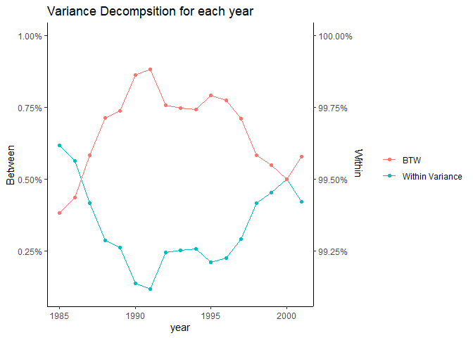
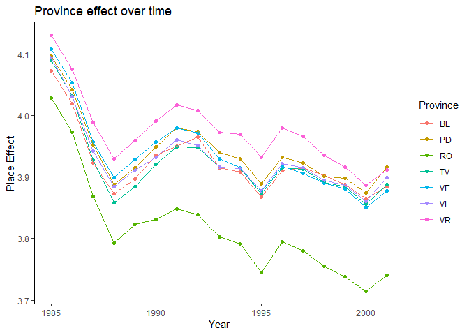
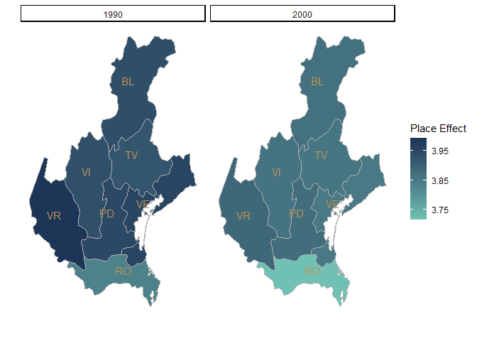
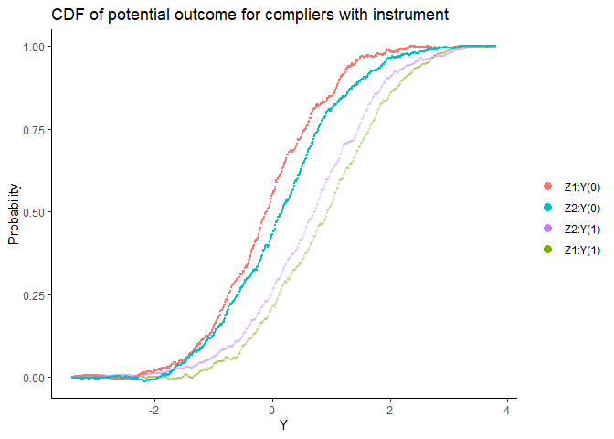

# 1. Wage analysis in Italy provinces


## (a) Creating dummies for gender and age

I create a variable called sex_dummy (=1, if the observation is male).
As for age variable, I use year - birth as age variable. 
If we want a series of dummies for age later, I'll just use as.factor() to create them.


## (b) Decompose the within province and between province variance

The wihin variance and between variacnce are shown as follows separately and in order.

This table briefly the source of variance are mainly within provinces. That is, the wage variation/inequality is not mainly due to the difference among provinces. Instead, it is from the variation withing provinces.


```
## 
## ==============================
## within.variance among.variance
## ------------------------------
## 507,255.700       3,062.185   
## ------------------------------
```

Based on the figure, we can find the vairance of daily wage most result from within variance. We could conclude that more than 99% of the wage inequality is within provinces. Recently, after 1990, within variance increased and between variance decreased. Until 2000, the trend seemed to be mitigated.

<!-- -->
## (c) How a province relate to the daily wage

This table is the result of for province fixed effects. To interpret the table, we can say the dailywage of labor in VR is higher than BL about 0.05 in average, based on the same age and gender. We can find VR has the largest place effect, which is 0.05 higher than BL, However, with this table, we only can observe the place province effects on wages in 1995. Thus, we refer to the next figure to see how the place effect on wage changes. 


```
## 
## Province fixed effect
## ====================================================
##                           Dependent variable:       
##                     --------------------------------
##                              log_dailywages         
## ----------------------------------------------------
## PD                              0.018***            
##                                 (0.001)             
##                                                     
## RO                             -0.109***            
##                                 (0.001)             
##                                                     
## TV                              -0.002*             
##                                 (0.001)             
##                                                     
## VE                              0.010***            
##                                 (0.001)             
##                                                     
## VI                              0.006***            
##                                 (0.001)             
##                                                     
## VR                              0.050***            
##                                 (0.001)             
##                                                     
## Age                             0.044***            
##                                 (0.0001)            
##                                                     
## Age Squared                    -0.0005***           
##                                (0.00000)            
##                                                     
## Sex dummy                      -0.270***            
##                                 (0.0004)            
##                                                     
## BL                              3.896***            
##                                 (0.003)             
##                                                     
## ----------------------------------------------------
## Observations                   3,033,744            
## R2                               0.189              
## Adjusted R2                      0.189              
## Residual Std. Error       0.369 (df = 3033718)      
## F Statistic         28,193.550*** (df = 25; 3033718)
## ====================================================
## Note:                    *p<0.1; **p<0.05; ***p<0.01
```
We can see the place effect of VR is still the largest among most of the time. Then, we can say that VR drives up wages the most.
Also, we find that place effect was decreasing over the time.
<!-- -->


## (d) Visualization

This figure is a visualization of the line graph. We can find place effect decreased for all provinces here. It clearly shows there is less place effect in 2000 than 1990.

<!-- -->

# 2. Instrument variable and Omitted Variable Bias


## (a) The relationship between institution quality and gdp


```
## 
## ===============================================
##                         Dependent variable:    
##                     ---------------------------
##                                lgdp            
## -----------------------------------------------
## inst                         4.479***          
##                               (0.422)          
##                                                
## colony                        -0.108           
##                               (0.142)          
##                                                
## tropics                       -0.259*          
##                               (0.151)          
##                                                
## Constant                     5.059***          
##                               (0.383)          
##                                                
## -----------------------------------------------
## Observations                    97             
## R2                             0.754           
## Adjusted R2                    0.746           
## Residual Std. Error       0.530 (df = 93)      
## F Statistic           95.092*** (df = 3; 93)   
## ===============================================
## Note:               *p<0.1; **p<0.05; ***p<0.01
```

This table suggests that institution quality and gdp have significantly positive relationship. However, this does not mean institution quality has positive causal effect on log gdp.

## (b) Conditional mean of island with different background


```
## 
## =========================================================
##   colony tropics mean of lgdp mean of institution quality
## ---------------------------------------------------------
## 1   No     No       8.931                0.866           
## 2   No     Yes      8.346                0.783           
## 3  Yes     No       8.593                0.811           
## 4  Yes     Yes      7.355                0.595           
## ---------------------------------------------------------
```

The condiational means of lgdp and inst for the combination of colony and tropics are shown in the table. For example, the first row shows the average gdp and the average institution quality of the islands which was colonized and is in tropics area.

## (c) OLS on covariates


```
## 
## ==========================================================
##                                   Dependent variable:     
##                               ----------------------------
##                                    lgdp          inst     
##                                    (1)            (2)     
## ----------------------------------------------------------
## colony                            -0.339        -0.054    
##                                  (0.232)        (0.038)   
##                                                           
## tropics                           -0.585        -0.082    
##                                  (0.417)        (0.069)   
##                                                           
## col_trop                          -0.652        -0.133*   
##                                  (0.468)        (0.077)   
##                                                           
## Constant                         8.931***      0.866***   
##                                  (0.147)        (0.024)   
##                                                           
## ----------------------------------------------------------
## Observations                        97            97      
## R2                                0.468          0.492    
## Adjusted R2                       0.450          0.476    
## Residual Std. Error (df = 93)     0.780          0.128    
## F Statistic (df = 3; 93)        27.228***      30.074***  
## ==========================================================
## Note:                          *p<0.1; **p<0.05; ***p<0.01
```

## (d) instrument regression

The result in the following table shows IV estimation. The coefficient of inst ($\gamma$) is the same as we did in (b) and (c)


```
## 
## 2 stage least square
## ===============================================
##                         Dependent variable:    
##                     ---------------------------
##                                lgdp            
## -----------------------------------------------
## inst                          4.888**          
##                               (2.395)          
##                                                
## colony                        -0.072           
##                               (0.250)          
##                                                
## tropics                       -0.182           
##                               (0.469)          
##                                                
## Constant                      4.699**          
##                               (2.107)          
##                                                
## -----------------------------------------------
## Observations                    97             
## R2                             0.752           
## Adjusted R2                    0.744           
## Residual Std. Error       0.533 (df = 93)      
## ===============================================
## Note:               *p<0.1; **p<0.05; ***p<0.01
```

## (e) 2SLS regression


```
## 
## second stage
## ==========================================================
##                                   Dependent variable:     
##                               ----------------------------
##                                    inst          lgdp     
##                                    (1)            (2)     
## ----------------------------------------------------------
## fit_inst                                         4.888    
##                                                 (3.507)   
##                                                           
## colony                            -0.054        -0.072    
##                                  (0.038)        (0.366)   
##                                                           
## tropics                           -0.082        -0.182    
##                                  (0.069)        (0.687)   
##                                                           
## col_trop                         -0.133*                  
##                                  (0.077)                  
##                                                           
## Constant                         0.866***        4.699    
##                                  (0.024)        (3.085)   
##                                                           
## ----------------------------------------------------------
## Observations                        97            97      
## R2                                0.492          0.468    
## Adjusted R2                       0.476          0.450    
## Residual Std. Error (df = 93)     0.128          0.780    
## F Statistic (df = 3; 93)        30.074***      27.228***  
## ==========================================================
## Note:                          *p<0.1; **p<0.05; ***p<0.01
```

The table above shows the coefficient of institution quality is the same as (d), but the standard error is different. It's because when we are doing 2SLS separately in two stages, we misidentify the error term. Thus, we care about the variance in (d) more. That is, one unit of institution quality increases the log gdp by 4.888 siginifcantly, which is larger than the estimates obtained from simple oLS.

# 3. IV with Heterogeneous Effects


## (a) Overidentification and wald estimate


```
## 
## =====================================
## Wald estimate (Z1) Wald estimate (Z2)
## -------------------------------------
## 0.98                      0.51       
## -------------------------------------
```

Overidentification are showns as follow:


```
## 
## sargan test
## ============================================
##                  df1  df2  statistic p-value
## --------------------------------------------
## Weak instruments  2  9,997  656.501     0   
## Wu-Hausman        1  9,997   8.555    0.003 
## Sargan            1         12.032    0.001 
## --------------------------------------------
```

We reject the null hypothesis because the p-value of sargan test is 0.001, 
so we reject the null hypothesis. However, since this problem is about
heterogeneous treatment effects, rejecting Sargan test means that either one of
the IVs is invalid, or they are identifying distinct LATEs.

## (b) ratio of the compliers of treatments


```
## 
## ============================================================
##                                     Dependent variable:     
##                                 ----------------------------
##                                              XT             
##                                      (1)            (2)     
## ------------------------------------------------------------
## T                                  0.881***      0.168***   
##                                    (0.034)        (0.032)   
##                                                             
## Constant                          -0.172***      0.187***   
##                                    (0.017)        (0.017)   
##                                                             
## ------------------------------------------------------------
## Observations                        10,000        10,000    
## R2                                  0.219          0.193    
## Adjusted R2                         0.219          0.193    
## Residual Std. Error (df = 9998)     0.393          0.400    
## ============================================================
## Note:                            *p<0.1; **p<0.05; ***p<0.01
```

By Abadie(2002), the mean of compliers is the coefficient of T in the following Table. The coefficient of T in column(1) and column (2) is the mean for complier complied with Z1 and Z2 separately.  They are 0.881 and 0.168 separately.

## (c) the CDFs of potential outcomes, Yi(1) and Yi(0)




The CDFs is the potential outcomes, Yi(1) and Yi(0), for individuals that comply with each instrument.


