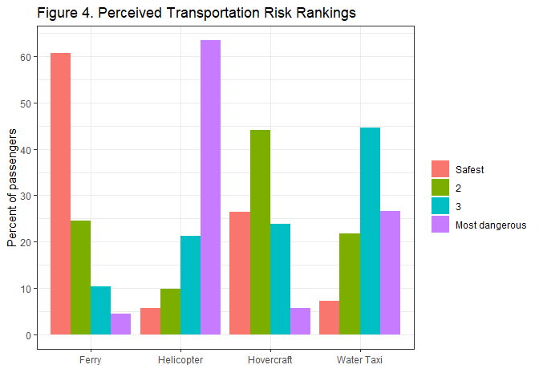

# Risky Transportation Choices and the Value of a Statistical Life

## (1)


```r
# Formula of weighted variance
weighted.var <- function(x, w, na.rm = FALSE) {
    if (na.rm) {
        w <- w[i <- !is.na(x)]
        x <- x[i]
    }
    sum.w <- sum(w)
    sum.w2 <- sum(w^2)
    mean.w <- sum(x * w)/sum(w)
    (sum.w/(sum.w^2 - sum.w2)) * sum(w * (x - mean.w)^2, na.rm = na.rm)
}
# Panel A Transform data for the first column
table3_1 = transpose(df1 %>% filter(alt == 1, sample_af == 1) %>% dummy_columns(select_columns = "mode") %>% 
    summarise(Helicopter = weighted.mean(mode_1, weight), `Water Taxi` = weighted.mean(mode_2, 
        weight), Ferry = weighted.mean(mode_3, weight), Hovercraft = weighted.mean(mode_4, 
        weight), Helicopter_SD = sqrt(weighted.var(mode_1, weight)), WaterTaxi_SD = sqrt(weighted.var(mode_2, 
        weight)), Ferry_SD = sqrt(weighted.var(mode_3, weight)), Hovercrat_SD = sqrt(weighted.var(mode_4, 
        weight))))
table3_1 = as.data.frame(cbind(table3_1[c(1:4), ], table3_1[c(5:8), ]))
colnames(table3_1) = c("Mean (Africans)", "SD (Africans)")
# Transpose data for the second column
table3_2 = transpose(df1 %>% filter(alt == 1, sample_noaf == 1) %>% dummy_columns(select_columns = "mode") %>% 
    summarise(Helicopter = weighted.mean(mode_1, weight), `Water Taxi` = weighted.mean(mode_2, 
        weight), Ferry = weighted.mean(mode_3, weight), Hovercraft = weighted.mean(mode_4, 
        weight), Helicopter_SD = sqrt(weighted.var(mode_1, weight)), WaterTaxi_SD = sqrt(weighted.var(mode_2, 
        weight)), Ferry_SD = sqrt(weighted.var(mode_3, weight)), Hovercrat_SD = sqrt(weighted.var(mode_4, 
        weight))))
table3_2 = as.data.frame(cbind(table3_2[c(1:4), ], table3_2[c(5:8), ]))
colnames(table3_2) = c("Mean (Non-Africans)", "SD (Non-Africans)")
# Transpose data for the third column
table3_3 = transpose(df1 %>% filter(alt == 1, sample_all == 1) %>% dummy_columns(select_columns = "mode") %>% 
    summarise(Helicopter = weighted.mean(mode_1, weight), `Water Taxi` = weighted.mean(mode_2, 
        weight), Ferry = weighted.mean(mode_3, weight), Hovercraft = weighted.mean(mode_4, 
        weight), Helicopter_SD = sqrt(weighted.var(mode_1, weight)), WaterTaxi_SD = sqrt(weighted.var(mode_2, 
        weight)), Ferry_SD = sqrt(weighted.var(mode_3, weight)), Hovercrat_SD = sqrt(weighted.var(mode_4, 
        weight))))
table3_3 = as.data.frame(cbind(table3_3[c(1:4), ], table3_3[c(5:8), ]))
colnames(table3_3) = c("Mean (Full sample)", "SD (Full sample)")

table3 = bind_cols(table3_1, table3_2, table3_3) %>% mutate(`Transportation choices` = c("Helicopter", 
    "Water Taxi", "Ferry", "Hovercraft"))
# Table
col_label = c("Mean <br>Africans", "SD <br>(Africans)", "Mean <br>(Non-Africans)", 
    "SD <br>(Non-Africans)", "Mean <br>(Full sample)", "SD <br>(Full sample)")
table3 = table3[, c(7, 1:6)]
stargazer(table3[], header = F, title = "Transportation choices", summary = F, digits = 2, 
    type = "html", rownames = F, out = "table1.html", column.labels = col_label)
```


<table style="text-align:center"><caption><strong>Transportation choices</strong></caption>
<tr><td colspan="7" style="border-bottom: 1px solid black"></td></tr><tr><td style="text-align:left">Transportation choices</td><td>Mean (Africans)</td><td>SD (Africans)</td><td>Mean (Non-Africans)</td><td>SD (Non-Africans)</td><td>Mean (Full sample)</td><td>SD (Full sample)</td></tr>
<tr><td colspan="7" style="border-bottom: 1px solid black"></td></tr><tr><td style="text-align:left">Helicopter</td><td>0.02</td><td>0.13</td><td>0.03</td><td>0.16</td><td>0.02</td><td>0.14</td></tr>
<tr><td style="text-align:left">Water Taxi</td><td>0.20</td><td>0.40</td><td>0.36</td><td>0.48</td><td>0.25</td><td>0.43</td></tr>
<tr><td style="text-align:left">Ferry</td><td>0.67</td><td>0.47</td><td>0.36</td><td>0.48</td><td>0.57</td><td>0.50</td></tr>
<tr><td style="text-align:left">Hovercraft</td><td>0.11</td><td>0.32</td><td>0.25</td><td>0.43</td><td>0.16</td><td>0.37</td></tr>
<tr><td colspan="7" style="border-bottom: 1px solid black"></td></tr></table>
  

  

```r
# Panel B Column 1
panelb_1 = transpose(df2 %>% filter(nationality < 3 & sample_all == 1) %>% summarise(weighted.mean(gender, 
    weight), weighted.mean(age, weight), weighted.mean(educ_low, weight), weighted.mean(educ_high, 
    weight), weighted.mean(affected, weight), weighted.mean(children, weight), weighted.mean(swim, 
    weight), weighted.mean(nationality_1, weight), weighted.mean(wage_hr_ppp, weight, 
    na.rm = TRUE), weighted.mean(wage_imput_ppp, weight), weighted.mean(life_exp, 
    weight), weighted.mean(fatalism, weight), sgender = sqrt(weighted.var(gender, 
    weight, na.rm = TRUE)), sage = sqrt(weighted.var(age, weight, na.rm = TRUE)), 
    seduc_low = sqrt(weighted.var(educ_low, weight, na.rm = TRUE)), seduc_high = sqrt(weighted.var(educ_high, 
        weight, na.rm = TRUE)), saffected = sqrt(weighted.var(affected, weight, na.rm = TRUE)), 
    schildren = sqrt(weighted.var(children, weight, na.rm = TRUE)), sswim = sqrt(weighted.var(swim, 
        weight, na.rm = TRUE)), snationality_1 = sqrt(weighted.var(nationality_1, 
        weight, na.rm = TRUE)), swage_hr_ppp = sqrt(weighted.var(wage_hr_ppp, weight, 
        na.rm = TRUE)), swage_imput_ppp = sqrt(weighted.var(wage_imput_ppp, weight, 
        na.rm = TRUE)), slife_exp = sqrt(weighted.var(life_exp, weight, na.rm = TRUE)), 
    sfatalism = sqrt(weighted.var(fatalism, weight, na.rm = TRUE))))
panelb_1 = as.data.frame(cbind(panelb_1[c(1:12), ], panelb_1[c(13:24), ]))
colnames(panelb_1) = c("Mean <br> (Africans)", "SD <br> (Africans)")
# Column 2
panelb_2 = transpose(df2 %>% filter(nationality == 3 & sample_all == 1) %>% summarise(weighted.mean(gender, 
    weight), weighted.mean(age, weight), weighted.mean(educ_low, weight), weighted.mean(educ_high, 
    weight), weighted.mean(affected, weight), weighted.mean(children, weight), weighted.mean(swim, 
    weight), weighted.mean(nationality_1, weight), weighted.mean(wage_hr_ppp, weight, 
    na.rm = TRUE), weighted.mean(wage_imput_ppp, weight), weighted.mean(life_exp, 
    weight), weighted.mean(fatalism, weight), sgender = sqrt(weighted.var(gender, 
    weight, na.rm = TRUE)), sage = sqrt(weighted.var(age, weight, na.rm = TRUE)), 
    seduc_low = sqrt(weighted.var(educ_low, weight, na.rm = TRUE)), seduc_high = sqrt(weighted.var(educ_high, 
        weight, na.rm = TRUE)), saffected = sqrt(weighted.var(affected, weight, na.rm = TRUE)), 
    schildren = sqrt(weighted.var(children, weight, na.rm = TRUE)), sswim = sqrt(weighted.var(swim, 
        weight, na.rm = TRUE)), snationality_1 = sqrt(weighted.var(nationality_1, 
        weight, na.rm = TRUE)), swage_hr_ppp = sqrt(weighted.var(wage_hr_ppp, weight, 
        na.rm = TRUE)), swage_imput_ppp = sqrt(weighted.var(wage_imput_ppp, weight, 
        na.rm = TRUE)), slife_exp = sqrt(weighted.var(life_exp, weight, na.rm = TRUE)), 
    sfatalism = sqrt(weighted.var(fatalism, weight, na.rm = TRUE))))
panelb_2 = as.data.frame(cbind(panelb_2[c(1:12), ], panelb_2[c(13:24), ]))
colnames(panelb_2) = c("Mean <br> (Non-Africans)", "SD <br> (Non-Africans)")
# Column 3
panelb_3 = transpose(df2 %>% filter(sample_all == 1) %>% summarise(weighted.mean(gender, 
    weight), weighted.mean(age, weight), weighted.mean(educ_low, weight), weighted.mean(educ_high, 
    weight), weighted.mean(affected, weight), weighted.mean(children, weight), weighted.mean(swim, 
    weight), weighted.mean(nationality_1, weight), weighted.mean(wage_hr_ppp, weight, 
    na.rm = TRUE), weighted.mean(wage_imput_ppp, weight), weighted.mean(life_exp, 
    weight), weighted.mean(fatalism, weight), sgender = sqrt(weighted.var(gender, 
    weight, na.rm = TRUE)), sage = sqrt(weighted.var(age, weight, na.rm = TRUE)), 
    seduc_low = sqrt(weighted.var(educ_low, weight, na.rm = TRUE)), seduc_high = sqrt(weighted.var(educ_high, 
        weight, na.rm = TRUE)), saffected = sqrt(weighted.var(affected, weight, na.rm = TRUE)), 
    schildren = sqrt(weighted.var(children, weight, na.rm = TRUE)), sswim = sqrt(weighted.var(swim, 
        weight, na.rm = TRUE)), snationality_1 = sqrt(weighted.var(nationality_1, 
        weight, na.rm = TRUE)), swage_hr_ppp = sqrt(weighted.var(wage_hr_ppp, weight, 
        na.rm = TRUE)), swage_imput_ppp = sqrt(weighted.var(wage_imput_ppp, weight, 
        na.rm = TRUE)), slife_exp = sqrt(weighted.var(life_exp, weight, na.rm = TRUE)), 
    sfatalism = sqrt(weighted.var(fatalism, weight, na.rm = TRUE))))
panelb_3 = as.data.frame(cbind(panelb_3[c(1:12), ], panelb_3[c(13:24), ]))
colnames(panelb_3) = c("Mean (Full <br> sample)", "SD (Full <br> Sample")

b_name = c("Gender (1 = Male)", "Age", "Educational Level: less than completed university", 
    "Educational Level: complete university or more", "Personally affected by civil conflict (Yes = 1)", 
    "Have Children? (Yes = 1)", "Knows how to swim?", "Sierrra Leonean", "Hourly wage (USD,PPP)- Measured", 
    "Hourly wage (USD,PPP)- imputed", "Self-reported life expectancy", "Self-reported fatalism")

panelb = bind_cols(panelb_1, panelb_2, panelb_3) %>% mutate(Variable = b_name)


panelb = panelb[, c(7, 1:6)]


stargazer(panelb, header = F, summary = F, digits = 2, colnames = T, " Respondent characteristics and attitudes", 
    type = "html", rownames = F)
```

```
## 
## <table style="text-align:center"><tr><td colspan="7" style="border-bottom: 1px solid black"></td></tr><tr><td style="text-align:left">Variable</td><td>Mean < br> (Africans)</td><td>SD < br> (Africans)</td><td>Mean < br> (Non-Africans)</td><td>SD < br> (Non-Africans)</td><td>Mean (Full < br> sample)</td><td>SD (Full < br> Sample</td></tr>
## <tr><td colspan="7" style="border-bottom: 1px solid black"></td></tr><tr><td style="text-align:left">Gender (1 = Male)</td><td>0.78</td><td>0.42</td><td>0.76</td><td>0.43</td><td>0.77</td><td>0.42</td></tr>
## <tr><td style="text-align:left">Age</td><td>39.87</td><td>10.91</td><td>41.17</td><td>11.98</td><td>40.34</td><td>11.31</td></tr>
## <tr><td style="text-align:left">Educational Level: less than completed university</td><td>0.23</td><td>0.42</td><td>0.13</td><td>0.34</td><td>0.19</td><td>0.40</td></tr>
## <tr><td style="text-align:left">Educational Level: complete university or more</td><td>0.77</td><td>0.42</td><td>0.87</td><td>0.34</td><td>0.81</td><td>0.40</td></tr>
## <tr><td style="text-align:left">Personally affected by civil conflict (Yes = 1)</td><td>0.58</td><td>0.49</td><td>0.15</td><td>0.36</td><td>0.43</td><td>0.50</td></tr>
## <tr><td style="text-align:left">Have Children? (Yes = 1)</td><td>0.81</td><td>0.39</td><td>0.69</td><td>0.46</td><td>0.77</td><td>0.42</td></tr>
## <tr><td style="text-align:left">Knows how to swim?</td><td>0.36</td><td>0.48</td><td>0.74</td><td>0.44</td><td>0.50</td><td>0.50</td></tr>
## <tr><td style="text-align:left">Sierrra Leonean</td><td>0.58</td><td>0.50</td><td>0</td><td>0</td><td>0.37</td><td>0.48</td></tr>
## <tr><td style="text-align:left">Hourly wage (USD,PPP)- Measured</td><td>25.68</td><td>28.09</td><td>50.77</td><td>57.03</td><td>34.38</td><td>42.19</td></tr>
## <tr><td style="text-align:left">Hourly wage (USD,PPP)- imputed</td><td>29.05</td><td>27.66</td><td>47.60</td><td>51.39</td><td>35.64</td><td>38.81</td></tr>
## <tr><td style="text-align:left">Self-reported life expectancy</td><td>42.75</td><td>11.90</td><td>39.77</td><td>12.27</td><td>41.69</td><td>12.10</td></tr>
## <tr><td style="text-align:left">Self-reported fatalism</td><td>4.21</td><td>3.05</td><td>3.27</td><td>2.58</td><td>3.87</td><td>2.92</td></tr>
## <tr><td colspan="7" style="border-bottom: 1px solid black"></td></tr></table>
## 
## <table style="text-align:center"><tr><td colspan="1" style="border-bottom: 1px solid black"></td></tr><tr><td>1</td></tr>
## <tr><td colspan="1" style="border-bottom: 1px solid black"></td></tr><tr><td>Respondent characteristics and attitudes</td></tr>
## <tr><td colspan="1" style="border-bottom: 1px solid black"></td></tr></table>
```

## (2) Figure 4


```r
df4 = df2 %>% filter(sample_all == 1) %>% group_by(weight, safest1_rain)

a = c(rep(1, 4), rep(2, 4), rep(3, 4), rep(4, 4))
df4 = as.data.frame(wtd.table(df4$safest1_rain, weights = df4$weight)) %>% bind_rows(as.data.frame(wtd.table(df4$safest2_rain, 
    weights = df4$weight))) %>% bind_rows(as.data.frame(wtd.table(df4$safest3_rain, 
    weights = df4$weight))) %>% bind_rows(as.data.frame(wtd.table(df4$safest4_rain, 
    weights = df4$weight))) %>% bind_cols(as.data.frame(a)) %>% mutate(Var1 = case_when(Var1 == 
    1 ~ "Helicopter", Var1 == 2 ~ "Water Taxi", Var1 == 3 ~ "Ferry", Var1 == 4 ~ 
    "Hovercraft"), a = case_when(a == 4 ~ "Most dangerous", a == 3 ~ "3", a == 2 ~ 
    "2", a == 1 ~ "Safest")) %>% group_by(a) %>% mutate(total = sum(Freq)) %>% ungroup()

df4$a = factor(df4$a, levels = c("Safest", "2", "3", "Most dangerous"))


ggplot(data = df4, aes(x = Var1, y = Freq/total * 100)) + geom_bar(aes(fill = a), 
    stat = "identity", position = "dodge") + labs(x = "", y = "Percent of passengers", 
    title = "Figure 4. Perceived Transportation Risk Rankings", fill = "") + scale_y_continuous(breaks = seq(0, 
    70, 10)) + theme_bw()
```



## (3)

Table 2 is the replication for Table A3 in online appendix.


```r
model1 = clogit(alt ~ risk_obs + transp_cost + strata(choice_situation) + cluster(serial), 
    weights = weight, data = (df1 %>% filter(sample_af == 1)), method = "approximate")

model2 = clogit(alt ~ risk_obs + transp_cost + seats + noise + crowdness + convloc + 
    clientele + strata(choice_situation) + cluster(serial), weights = weight, data = (df1 %>% 
    filter(sample_af == 1)), method = "approximate")

model3 = clogit(alt ~ risk_obs + transp_cost + strata(choice_situation) + cluster(serial), 
    weights = weight, data = (df1 %>% filter(sample_noaf == 1)), method = "approximate")

model4 = clogit(alt ~ risk_obs + transp_cost + seats + noise + crowdness + convloc + 
    clientele + strata(choice_situation) + cluster(serial), weights = weight, data = (df1 %>% 
    filter(sample_noaf == 1)), method = "approximate")

model5 = clogit(alt ~ risk_obs + transp_cost + strata(choice_situation) + cluster(serial), 
    weights = weight, data = (df1 %>% filter(sample_all == 1)), method = "approximate")

model6 = clogit(alt ~ risk_obs + transp_cost + seats + noise + crowdness + convloc + 
    clientele + strata(choice_situation) + cluster(serial), weights = weight, data = (df1 %>% 
    filter(sample_all == 1)), method = "approximate")


df3 = df1 %>% filter(alt == 1, sample_af == 1 | sample_noaf == 1) %>% drop_na(alt, 
    risk_obs, transp_cost, choice_situation, serial, weight) %>% group_by(sample_af) %>% 
    summarise(trips = n(), travelers = length(unique(serial)))

trips = c("Number of trips", rep(df3$trips[1], 2), rep(df3$trips[2], 2), rep(sum(df3$trips), 
    2))
travelers = c("Number of decision makers", rep(df3$travelers[1], 2), rep(df3$travelers[2], 
    2), rep(sum(df3$travelers), 2))


model = list(model1, model2, model3, model4, model5, model6)

mean_vsl = c("Mean VSL", 1:6)
low_vsl = c("2.5,percentile", 1:6)
high_vsl = c("97.5 percentile", 1:6)

for (i in 1:6) {
    sd = deltamethod(~x1/x2, coef(model[[i]]), vcov(model[[i]]))
    mean_vsl[i + 1] = round(model[[i]]$coefficients[1]/-model[[i]]$coefficients[2], 
        3)
    low_vsl[i + 1] = round(qnorm(0.025, as.numeric(mean_vsl[i + 1]), sd), 3)
    high_vsl[i + 1] = round(qnorm(0.975, as.numeric(mean_vsl[i + 1]), sd), 3)
}


stargazer(model, type = "html", omit = c(3:10), column.labels = c("Africans", "Non-Africans", 
    "All"), column.separate = c(2, 2, 2), dep.var.labels = "", covariate.labels = c("Prob. of completing the trip (1-p$\\_i$)", 
    "Total transportation cost (Cost\\_ij)"), digits = 3, keep.stat = c("n", "ll"), 
    add.lines = list(c("Controls for Perceived attributes", "No", "Yes", "No", "Yes", 
        "No", "Yes"), c("Observations <br> (respondent-alternative options)", 3281, 
        3281, 2124, 21124, 5405, 5405), trips, travelers, mean_vsl, low_vsl, high_vsl), 
    model.numbers = TRUE, header = FALSE, style = "qje", table.layout = "-c#-t-s-a-n")
```

```
## 
## <table style="text-align:center"><tr><td colspan="7" style="border-bottom: 1px solid black"></td></tr><tr><td style="text-align:left"></td><td colspan="2">Africans</td><td colspan="2">Non-Africans</td><td colspan="2">All</td></tr>
## <tr><td style="text-align:left"></td><td>(1)</td><td>(2)</td><td>(3)</td><td>(4)</td><td>(5)</td><td>(6)</td></tr>
## <tr><td colspan="7" style="border-bottom: 1px solid black"></td></tr><tr><td style="text-align:left">Prob. of completing the trip (1-p_i)</td><td>6.668<sup>***</sup></td><td>8.996<sup>***</sup></td><td>10.408<sup>***</sup></td><td>10.524<sup>***</sup></td><td>7.641<sup>***</sup></td><td>9.391<sup>***</sup></td></tr>
## <tr><td style="text-align:left"></td><td>(1.275)</td><td>(1.471)</td><td>(1.636)</td><td>(1.718)</td><td>(0.990)</td><td>(1.110)</td></tr>
## <tr><td style="text-align:left"></td><td></td><td></td><td></td><td></td><td></td><td></td></tr>
## <tr><td style="text-align:left">Total transportation cost (Cost_ij)</td><td>-0.021<sup>***</sup></td><td>-0.012<sup>***</sup></td><td>-0.004</td><td>-0.004</td><td>-0.016<sup>***</sup></td><td>-0.010<sup>***</sup></td></tr>
## <tr><td style="text-align:left"></td><td>(0.001)</td><td>(0.001)</td><td>(0.002)</td><td>(0.002)</td><td>(0.001)</td><td>(0.001)</td></tr>
## <tr><td style="text-align:left"></td><td></td><td></td><td></td><td></td><td></td><td></td></tr>
## <tr><td colspan="7" style="border-bottom: 1px solid black"></td></tr><tr><td style="text-align:left"><em>N</em></td><td>3,281</td><td>3,281</td><td>2,124</td><td>2,124</td><td>5,405</td><td>5,405</td></tr>
## <tr><td style="text-align:left">Log Likelihood</td><td>-1,216.268</td><td>-1,160.398</td><td>-618.982</td><td>-612.805</td><td>-1,869.394</td><td>-1,818.358</td></tr>
## <tr><td colspan="7" style="border-bottom: 1px solid black"></td></tr><tr><td style="text-align:left">Controls for Perceived attributes</td><td>No</td><td>Yes</td><td>No</td><td>Yes</td><td>No</td><td>Yes</td></tr>
## <tr><td style="text-align:left">Observations <br> (respondent-alternative options)</td><td>3281</td><td>3281</td><td>2124</td><td>21124</td><td>5405</td><td>5405</td></tr>
## <tr><td style="text-align:left">Number of trips</td><td>1083</td><td>1083</td><td>710</td><td>710</td><td>1793</td><td>1793</td></tr>
## <tr><td style="text-align:left">Number of decision makers</td><td>336</td><td>336</td><td>225</td><td>225</td><td>561</td><td>561</td></tr>
## <tr><td style="text-align:left">Mean VSL</td><td>319.985</td><td>778.496</td><td>2586.682</td><td>2960.805</td><td>482.681</td><td>984.267</td></tr>
## <tr><td style="text-align:left">2.5,percentile</td><td>156.025</td><td>235.992</td><td>-3644.366</td><td>-4657.212</td><td>243.193</td><td>199.131</td></tr>
## <tr><td style="text-align:left">97.5 percentile</td><td>483.945</td><td>1321</td><td>8817.73</td><td>10578.822</td><td>722.169</td><td>1769.403</td></tr>
## <tr><td colspan="7" style="border-bottom: 1px solid black"></td></tr><tr><td style="text-align:left"><em>Notes:</em></td><td colspan="6" style="text-align:right"><sup>***</sup>Significant at the 1 percent level.</td></tr>
## <tr><td style="text-align:left"></td><td colspan="6" style="text-align:right"><sup>**</sup>Significant at the 5 percent level.</td></tr>
## <tr><td style="text-align:left"></td><td colspan="6" style="text-align:right"><sup>*</sup>Significant at the 10 percent level.</td></tr>
## </table>
```

```r
# a = c(a[c(1:16,20,17,21,22,18,19)],'\\hline \\\\[-1.8ex] ',a[23:31])
# a[18] = 'Observations (respondent-alternative options) & 3,281 & 3,281 & 2,124
# & 2,124 & 5,405 & 5,405 \\\\ ' cat(a,sep = '\n')
```

