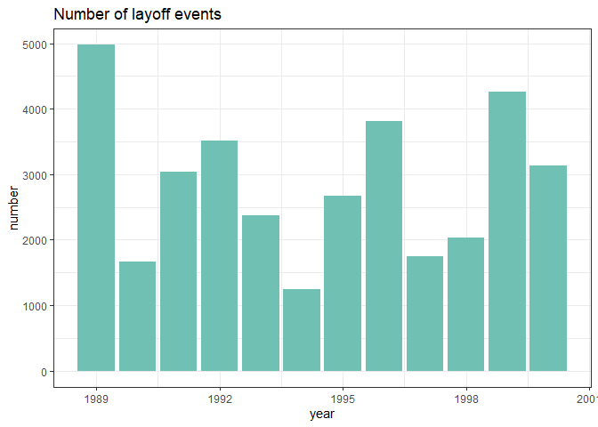
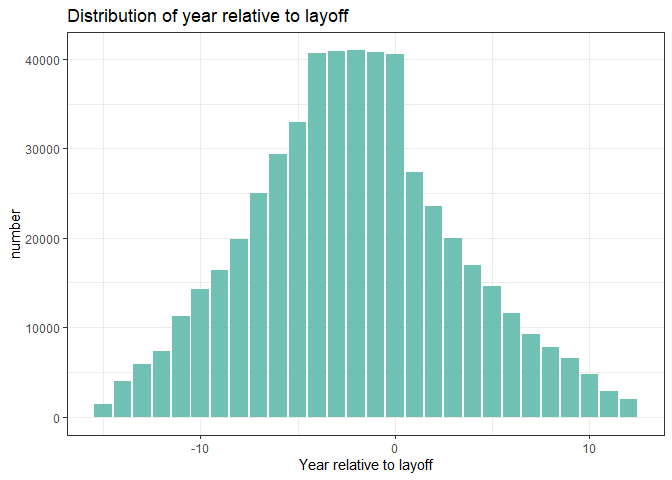
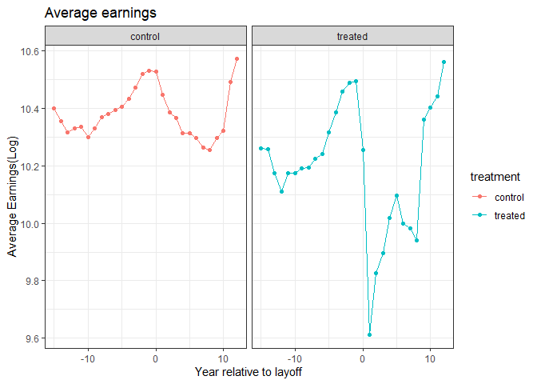
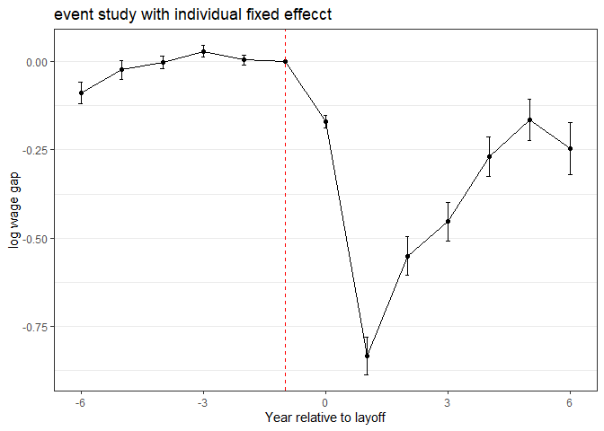
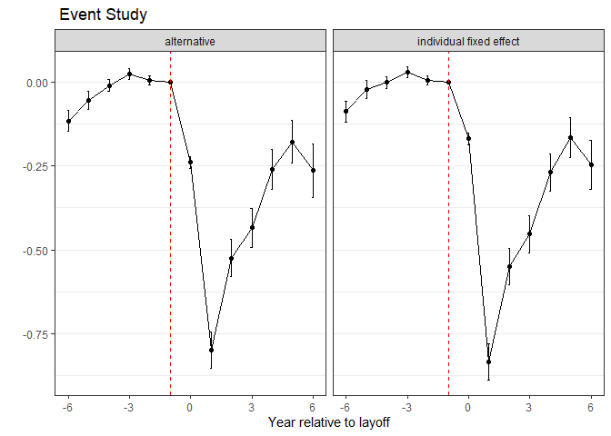

# Event Study with propensity Score mathcing


```r
df4 <- read_csv("dataset/short_fake_matched_employer_employee.csv")
```

## (a) Define the event of mass layoff

There are mainly three cases I defined as a mass layoff. First, a firm lost more than 30% of employees in a particular year, but still existed in the dataset in the year right after that year.
Second, a firm lost all its employees in a particular year and disappeared from the dataset temporarily. Third, a firm lost all its employees in a particular year and disappeared forever. 

If I count (1)+(2), I will have 268 mass layoffs.
If I count(1)+(2)+(3), I will have 420 mass layoffs and this is also the case I would like to use for the following analysis.


```r
df4_layoff = df4 %>% group_by(year, firmid) %>% summarize(size = n()) %>% ungroup() %>% 
    arrange(firmid, year) %>% mutate(next_size = if_else(firmid == lead(firmid) & 
    year == lead(year) - 1, lead(size), as.integer(0))) %>% mutate(layoff = if_else(next_size/size < 
    0.7, 1, 0)) %>% select(year, firmid, layoff, size) %>% filter(size >= 50) %>% 
    filter(year != 2001)

sum(df4_layoff$layoff)
```

```
## [1] 420
```

## (b) Detemine if a labor got laid off in a particular year

There are two steps to construct a variable indicating a worker was laid off or not in a particular year. First, he/she must work in a firm for at least consecutive 5 years. Second, we only consider a layoff which happened on a man for the first time.


```r
# define laid off workers: step1
df4_b = df4 %>% left_join(df4_layoff, by = c("year", "firmid")) %>% mutate(layoff = if_else(is.na(layoff), 
    0, layoff)) %>% mutate(tenure_check = paste(id, firmid)) %>% arrange(id, year) %>% 
    mutate(tenure = sequence(rle(tenure_check)$lengths)) %>% arrange(id, year) %>% 
    mutate(treated = case_when(layoff == 1 & id == lead(id) & firmid != lead(firmid) & 
        tenure >= 5 & firmid == lag(firmid) & firmid == lag(lag(firmid)) & firmid == 
        lag(lag(lag(firmid))) & firmid == lag(lag(lag(lag(firmid)))) ~ 1, layoff == 
        1 & id != lead(id) & tenure >= 5 & firmid == lag(firmid) & firmid == lag(lag(firmid)) & 
        firmid == lag(lag(lag(firmid))) & firmid == lag(lag(lag(lag(firmid)))) ~ 
        1, TRUE ~ 0))


# define laid off workers: step2
df4_b = df4_b %>% group_by(id) %>% mutate(total_layoff = sum(treated)) %>% ungroup() %>% 
    mutate(check = if_else(treated == 1 & total_layoff == 2, as.integer(year), as.integer(99999999))) %>% 
    group_by(id) %>% mutate(check = min(check)) %>% ungroup() %>% mutate(treated = if_else(treated == 
    1 & year > check, 0, treated)) %>% group_by(id) %>% mutate(total_layoff = sum(treated)) %>% 
    ungroup()

df4_test = df4_b %>% group_by(id) %>% mutate(max_treat = max(treated), max_gender = max(female)) %>% 
    fill_gap(year) %>% ungroup() %>% mutate(log_earnings = if_else(is.na(log_earnings), 
    as.numeric(0), log_earnings), log_dailywages = if_else(is.na(log_dailywages), 
    as.numeric(0), log_dailywages))

df4_test = df4_test %>% mutate(female = if_else(is.na(female), lag(female), female), 
    age = if_else(is.na(age), lag(age), age), max_treat = if_else(is.na(max_treat), 
        lag(max_treat), max_treat))

# balance check of treated group and groups of potential control
t1 = t.test(age ~ max_treat, data = df4_test)
t2 = t.test(female ~ max_treat, data = df4_test)
t3 = t.test(log_earnings ~ max_treat, data = df4_test)
t4 = t.test(log_dailywages ~ max_treat, data = df4_test)
# output
tab = map_df(list(t1, t2, t3, t4), tidy)
tab = tab %>% select(1:5)
colnames(tab) = c("Variable", "Control", "treated", "t-statistic", "p-value")
a = c("age", "female", "log_earnings", "log_dailywages")
tab = tab %>% mutate(Variable = a)

tab = tab %>% mutate_if(is.numeric, ~round(., 2))


stargazer(tab, summary = F, header = F, type = "text")
```
This table shows p-value fro different variables is vary small, it could be said that the observable characteristics are different from the remaining pool workers. In particular, people are generally younger, more likely to be male, have less dailywage and earnings in countrol group. The last two items may some how make no sense, but it is because we compare the whole dataset, including the periods may not affected by the layoff.


## (c) Probit model for for estimating propensity score


```r
df4_b = df4_b %>% arrange(id, year) %>% mutate(sector = str_sub(csc, end = 2)) %>% 
    mutate(lag2_wage = case_when(id == lag(lag(id)) & year == lag(lag(year)) + 2 ~ 
        lag(lag(log_dailywages)), id == lag(id) & year == lag(year) + 2 ~ lag(log_dailywages), 
        TRUE ~ 0))

yr_label = sort(unique((df4_b %>% filter(treated == 1))$year))
year_data = df4_b %>% filter(year == 1989)
ps_m = glm(treated ~ as.factor(sector) + lag2_wage + female + age + tenure, family = binomial(link = "probit"), 
    data = year_data)

ps_data = df4_b %>% filter(year == 1989) %>% mutate(ps = fitted.values(ps_m))

for (i in 2:length(yr_label)) {
    year_data = df4_b %>% filter(year == yr_label[i])
    ps_m = glm(treated ~ as.factor(sector) + lag2_wage + female + age + tenure, family = binomial(link = "probit"), 
        data = year_data)
    ps_data_loop = year_data %>% mutate(ps = fitted.values(ps_m))
    test = rbind(ps_data, ps_data_loop)
}
```

## (d) Propensity score matching for control and treated group


```r
year_data = df4_b %>% filter(year == 1989) %>% select(id, firmid, year, treated, 
    sector, lag2_wage, female, age, tenure)

matching = matchit(treated ~ as.factor(sector) + lag2_wage + female + age + tenure, 
    method = "nearest", distance = "probit", ratio = 1, data = year_data)
data = match.data(matching)
match = cbind(year_data[row.names(matching$match.matrix), "id"], year_data[matching$match.matrix, 
    "id"])
colnames(match) = c("treated", "control")
match = match %>% mutate(layoff_year = 1989)
for (i in 2:length(yr_label)) {
    year_data = df4_b %>% filter(year == yr_label[i]) %>% select(id, firmid, year, 
        treated, sector, lag2_wage, female, age, tenure)
    matching = matchit(treated ~ as.factor(sector) + lag2_wage + female + age + tenure, 
        method = "nearest", distance = "probit", ratio = 1, data = year_data)
    data = rbind(data, match.data(matching))
    match_loop = cbind(year_data[row.names(matching$match.matrix), "id"], year_data[matching$match.matrix, 
        "id"])
    colnames(match_loop) = c("treated", "control")
    match_loop = match_loop %>% mutate(layoff_year = yr_label[i])
    match = rbind(match, match_loop)
}
balance = data %>% mutate(year = year - 1, be_layoff = treated) %>% select(id, year, 
    be_layoff) %>% left_join(df4_b, by = c("id", "year"))
# Balance check after matching
t1 = t.test(age ~ treated, data = balance)
t2 = t.test(female ~ treated, data = balance)
t3 = t.test(log_earnings ~ treated, data = balance)
t4 = t.test(log_dailywages ~ treated, data = balance)
tab = map_df(list(t1, t2, t3, t4), tidy)
tab = tab %>% select(1:5)

# Output
colnames(tab) = c("Variable", "Control", "treated", "t-statistic", "p-value")
a = c("age", "female", "log_earnings", "log_dailywages")
tab = tab %>% mutate(Variable = a) %>% mutate_if(is.numeric, ~round(., 2))

stargazer(tab, summary = F, header = F, type = "text")
```

```
## 
## =====================================================
##      Variable    Control treated t-statistic  p-value
## -----------------------------------------------------
## 1      age        38.9    42.18  c(t = -1.09)   0.3  
## 2     female      0.35    0.27   c(t = 0.53)    0.6  
## 3  log_earnings   10.53   10.92  c(t = -1.78)  0.11  
## 4 log_dailywages  4.86     5.3   c(t = -2.1)   0.06  
## -----------------------------------------------------
```

After using propensity score mathcing strategy, the characteristics is quite similar between treatment group and control group this time. We cannot reject all the hypothesis at 0.05 level.


## (e) Process data to a complete panel for workers laid off


```r
df_treated = df4_b %>% filter(id %in% match$treated) %>% group_by(id) %>% fill_gap(year) %>% 
    mutate(min_year = min(year), max_year = max(year)) %>% ungroup() %>% select(id, 
    year, min_year, max_year, log_earnings)

df_treated_year = df_treated %>% group_by(id) %>% summarise(min_year = min(year), 
    max_year = max(year)) %>% ungroup()

df_control = df4_b %>% filter(id %in% match$control) %>% select(id, year, log_earnings) %>% 
    left_join(match, by = c(id = "control")) %>% left_join(df_treated_year, by = c(treated = "id")) %>% 
    filter(year >= min_year & year <= max_year) %>% group_by(id, treated) %>% fill_gap(year) %>% 
    ungroup() %>% select(id, year, min_year, max_year, log_earnings)

df_combine = rbind(df_treated, df_control)

df_e = gather(match, key = "treatment", value = "id", -layoff_year) %>% left_join(df_combine, 
    by = c(id = "id")) %>% mutate(log_earnings = if_else(is.na(log_earnings), 0, 
    log_earnings))
```

## (f) Average earning of control and treated group


```r
# Create event study dummies
df_e = df_e %>% mutate(event = year - layoff_year)
df_f = df_e %>% group_by(id, layoff_year) %>% summarise(hr = max(max_year)) %>% ungroup()
df_average = df_e %>% group_by(event, treatment) %>% summarise(average_log_earnings = mean(log_earnings))

# Layoff events in each year
ggplot(data = df_f) + geom_bar(aes(x = layoff_year), fill = "#70c1b3") + labs(title = "Number of layoff events", 
    x = "year", y = "number") + theme_bw()
```



```r
ggplot(data = df_e) + geom_bar(aes(x = event), fill = "#70c1b3") + labs(title = "Distribution of year relative to layoff", 
    x = "Year relative to layoff", y = "number") + theme_bw()
```



```r
ggplot(data = df_average) + geom_point(aes(x = event, y = average_log_earnings, color = treatment)) + 
    geom_line(aes(x = event, y = average_log_earnings, color = treatment)) + facet_grid(~treatment) + 
    labs(y = "Average Earnings(Log)", title = "Average earnings", x = "Year relative to layoff") + 
    theme_bw()
```



In the fist figure, the number of workers laid off is ranged from 1000 to 5000 per year, and there is no obvious trend for layoffs. The second barchart shows the event study dummy distribution. It helps to decide the binn up,  using leads/lags = 6 to do the following exercise.
In the last graph, the average earnings are almost identical across control group and the treated group before workers who got layoff. However, it drops a lot after being laidoff and it take almost ten years to climb back to the level as high as control group.

## (g) Event study model with individual fixed effect after matching


```r
df_f = df_e %>% mutate(treat_dumm = if_else(treatment == "treated", 1, 0)) %>% filter(event >= 
    -6 & event <= 6) %>% mutate(interact = event * treat_dumm) %>% mutate(event = as.factor(event), 
    interact = as.factor(interact))

df_f = within(df_f, event <- relevel(event, ref = 6))
df_f = within(df_f, interact <- relevel(interact, ref = 6))

model4_f = felm(data = df_f, log_earnings ~ interact + event | id | 0 | id)

coef_table_4f = summary(model4_f)$coefficients
coef_table_4f = (as.data.frame(coef_table_4f) %>% mutate(x = row.names(coef_table_4f)))[1:12, 
    ]

colnames(coef_table_4f) = c("beta", "se", "t_value", "p_value", "event")


coef_table_4f = coef_table_4f %>% mutate(lb = beta - 1.96 * se, ub = beta + 1.96 * 
    se, event = as.integer(str_remove(event, "interact"))) %>% rbind(c(0, 0, 0, 0, 
    -1, 0, 0)) %>% mutate(model = "individual fixed effect")


ggplot(data = coef_table_4f, aes(x = event)) + geom_point(aes(y = beta)) + geom_errorbar(aes(ymin = lb, 
    ymax = ub), width = 0.1) + geom_point(aes(x = -1, y = 0)) + geom_line(aes(y = beta)) + 
    geom_vline(aes(xintercept = -1), color = "red", linetype = "dashed") + theme_bw() + 
    labs(x = "Year relative to layoff", y = "log wage gap", title = "event study with individual fixed effecct") + 
    theme(panel.grid.major.x = element_blank()) + theme(panel.grid.minor.x = element_blank())
```



With the setup of normalizing the perod one year before layoff as a baseline and clustering the standard errors at id level to adjust the possible unobserved correlation within an individual, it's easier to compare the earnings between control group and treated group. For example, we can say the earnings people in control group and treatment group earned are quite similar. However, after being laidoff, people who got layoff earned much less in average. The effect is still significant 6 years after they got layoff.

## (h) Event study model without individual fixed effect after matching


```r
model4_h = felm(data = df_f, log_earnings ~ event * treat_dumm + event | 0 | 0 | 
    id)

coef_table_4h = summary(model4_h)$coefficients
coef_table_4h = (as.data.frame(coef_table_4h) %>% mutate(x = row.names(coef_table_4h)))[15:26, 
    ]
colnames(coef_table_4h) = c("beta", "se", "t_value", "p_value", "event")
coef_table_4h = coef_table_4h %>% mutate(lb = beta - 1.96 * se, ub = beta + 1.96 * 
    se, event = str_remove(event, "event")) %>% mutate(event = as.integer(str_remove(event, 
    ":treat_dumm"))) %>% rbind(c(0, 0, 0, 0, -1, 0, 0)) %>% mutate(model = "alternative") %>% 
    bind_rows(coef_table_4f)

ggplot(data = coef_table_4h, aes(x = event)) + geom_point(aes(y = beta)) + geom_errorbar(aes(ymin = lb, 
    ymax = ub), width = 0.1) + geom_point(aes(x = -1, y = 0)) + geom_line(aes(y = beta)) + 
    geom_vline(aes(xintercept = -1), color = "red", linetype = "dashed") + facet_wrap(~model) + 
    theme_bw() + labs(x = "Year relative to layoff", y = " ", title = " Event Study") + 
    theme(panel.grid.major.x = element_blank()) + theme(panel.grid.minor.x = element_blank())
```



Compared to the result in last part (individual fixed effect), this graph has a similar trend. Although the results in (g) and (h) are roughly identital, individual fixed effect could still better explain the model because it capture the unobservable characteristics within an individual.

To improve the matching algorithm, kernel matching algorithm could be considerated, it take more control units into consideration and give them different weight depending on their similarity.
