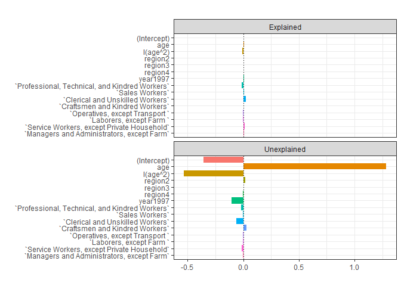

# 1. Oaxaca decomposition and Autor, Katz and Kearney (2008)
Brief introduction: This paper try to find the trend of wage in US. Also, they use the census data in 1979 and 1997 to look for what is the main reason for the change in wages in US, the change of demographic or the erosion of minimum wage?

```r
# Import dataset
df2_1979 <- read_dta("./dataset/morg_cleaned_1979-occ.dta")
df2_1997 <- read_dta("./dataset/morg_cleaned_1997-occ.dta")
```
## (a) Process the data
### Step1
I added lnhr_wage and limited our  attenetion to the sample with "lhhr_wage" in both datasets. Then, selected the charateristecs we would like to use in this part. Also, I combined these two datasets as df_b

### Step2
Then, in the linear model, I first used the as.factor function to create a series of dummy variables of regions, occupations and year. Then, I decided to run the regression for male and female separately. 


```r
# Transform the data
df_b = bind_rows((df2_1979 %>% filter(hr_wage_sample == 1) %>% mutate(lnhr_wage = log(hr_wage)) %>% 
    dplyr::select(lnhr_wage, age, occ, region, sex, year)), (df2_1997 %>% filter(hr_wage_sample == 
    1) %>% mutate(lnhr_wage = log(hr_wage)) %>% dplyr::select(lnhr_wage, age, occ, 
    region, sex, year)))

# Classify the occupation
df_b = df_b %>% mutate(year = as.factor(as.character(year)), region = as.factor(as.character(region))) %>% 
    mutate(Title = case_when(occ %in% c(1:195) ~ 1, occ %in% c(260:280) ~ 2, occ %in% 
        c(301:395) ~ 3, occ %in% c(401:580) ~ 4, occ %in% c(601:695) ~ 5, occ %in% 
        c(701:715) ~ 6, occ %in% c(740:785) ~ 7, occ %in% c(801:802) ~ 8, occ %in% 
        c(821:824) ~ 9, occ %in% c(901:965) ~ 10, occ %in% c(980:984) ~ 11, occ %in% 
        c(0, 590, 990, 995) ~ 12, occ %in% c(201:245) ~ 13, TRUE ~ 14)) %>% group_by(Title, 
    sex, year, region) %>% mutate(count = n()) %>% ungroup() %>% filter(count > 500) %>% 
    mutate(`Professional, Technical, and Kindred Workers` = if_else(occ %in% c(1:195), 
        1, 0), `Sales Workers` = if_else(occ %in% c(260:280), 1, 0), `Clerical and Unskilled Workers` = if_else(occ %in% 
        c(301:395), 1, 0), `Craftsmen and Kindred Workers` = if_else(occ %in% c(401:580), 
        1, 0), `Operatives, except Transport ` = if_else(occ %in% c(601:695), 1, 
        0), `Transport Equipment Operatives` = if_else(occ %in% c(701:715), 1, 0), 
        `Laborers, except Farm ` = if_else(occ %in% c(740:785), 1, 0), `Farmers and Farm Managers` = if_else(occ %in% 
            c(801:802), 1, 0), `Farm Laborers and Farm Foremen` = if_else(occ %in% 
            c(821:824), 1, 0), `Service Workers, except Private Household` = if_else(occ %in% 
            c(901:965), 1, 0), `Private Household Workers` = if_else(occ %in% c(980:984), 
            1, 0), `Additional NLSY79 Occupation Codes` = if_else(occ %in% c(0, 590, 
            990, 995), 1, 0), `Managers and Administrators, except Farm` = if_else(occ %in% 
            c(201:245), 1, 0)) %>% mutate(sex = if_else(sex == 2, 1, 0))
```

## (b) oaxaca decompostion


```r
# oaxaca decomposition
results <- oaxaca(lnhr_wage ~ age + I(age^2) + region + year + `Professional, Technical, and Kindred Workers` + 
    `Sales Workers` + `Clerical and Unskilled Workers` + `Craftsmen and Kindred Workers` + 
    `Operatives, except Transport ` + `Laborers, except Farm ` + `Service Workers, except Private Household` + 
    `Managers and Administrators, except Farm` | sex, data = df_b, R = NULL)
avg_gap = results$y$y.diff
explained = (results$x$x.mean.diff) %*% results$beta$beta.A
unexplained = results$x$x.mean.B %*% (results$beta$beta.A - results$beta$beta.B)
# Create Output
dif = data.frame(Value = c(avg_gap, explained, unexplained))
rownames(dif) <- c("Gender Wage Gap", "Explained ", "Unexplained")
# Output
stargazer(dif, summary = FALSE, header = FALSE, type = "text")
```

```
## 
## =====================
##                 Value
## ---------------------
## Gender Wage Gap 0.299
## Explained       0.015
## Unexplained     0.284
## ---------------------
```
This table tells us that most of the wage gap between genders is unexplained, which could be supposed as discrimination. The explained gender is due to the different characteristic of women and men.

## (c) Wage distribution shiftment
This figure shows the distribution of wages in 1979 and 1997.We can
see the erosion of the minimum wage: the 1979 distribution has a "spike" while
the 1997 distribution does not. The 1997 distribution has more dispersal overal,
with more mass in the lower and upper tail.

```r
ggplot(data = df_b, aes(x = lnhr_wage, color = year)) + geom_line(stat = "density") + 
    theme_classic() + labs(x = "Wage", y = "kdensity", title = "Log hourly wage distribution")
```




## (d) How the distribution changes from 1979 to 1997 in different groups

```r
df_d = bind_rows((df2_1979 %>% filter(hr_wage_sample == 1) %>% mutate(lnhr_wage = log(hr_wage)) %>% 
    select(lnhr_wage, age, occ, region, sex, year, race)), (df2_1997 %>% 
    filter(hr_wage_sample == 1) %>% mutate(lnhr_wage = log(hr_wage)) %>% select(lnhr_wage, 
    age, occ, region, sex, year, race)))

df_d_black = df_d %>% filter(race == 2 & age <= 50 & age >= 25 & sex == 1)
df_d_white = df_d %>% filter(race == 1 & age <= 50 & age >= 25 & sex == 2)


ggplot(data = df_d_black, aes(x = lnhr_wage, color = as.factor(year))) + geom_line(stat = "density") + 
    theme_classic() + labs(x = "Wage", y = "kdensity", title = "Log hourly wage distribution (black men)") + 
    theme(legend.title = element_blank())
```


```r
ggplot(data = df_d_white, aes(x = lnhr_wage, color = as.factor(year))) + geom_line(stat = "density") + 
    theme_classic() + labs(x = "Wage", y = "kdensity", title = "Log hourly wage distribution (white women)") + 
    theme(legend.title = element_blank())
```


The log hourly wage distribution in 1979 and 1997 for black men is shown in
the firt graph.The distribution remarkably shifted to the left. The log hourly wage distribution for women is shown in the second fiture, and shows a similar pattern to the overall distribution of increasing spread and erosion of the minimum wage.

## (e) demographic change from 1979 to 1997

```r
df_d = df_d %>% mutate(year = if_else(year == 1997, 1, 0)) %>% mutate(black = if_else(race == 
    2, 1, 0)) %>% mutate(others = if_else(race == 3, 1, 0), female = if_else(sex == 
    2, 1, 0))


model_logit = glm(year ~ female + black + others + age + I(age^2), family = binomial(), 
    data = df_d)
stargazer(model_logit, type = "text", header = FALSE)
```

```
## 
## =============================================
##                       Dependent variable:    
##                   ---------------------------
##                              year            
## ---------------------------------------------
## female                     0.197***          
##                             (0.008)          
##                                              
## black                      -0.064***         
##                             (0.015)          
##                                              
## others                     0.529***          
##                             (0.022)          
##                                              
## age                        0.142***          
##                             (0.002)          
##                                              
## I(age2)                    -0.002***         
##                            (0.00003)         
##                                              
## Constant                   -3.001***         
##                             (0.038)          
##                                              
## ---------------------------------------------
## Observations                247,784          
## Log Likelihood           -167,058.100        
## Akaike Inf. Crit.         334,128.200        
## =============================================
## Note:             *p<0.1; **p<0.05; ***p<0.01
```
This table shows that there are more female, less black, and more people in other race in 1979. Also people are generally older in average in 1979. Although we shit of wage distribution could be caused by these demographic changs.

## (f) Reweight the distribution in 1997
To see the distriution is cause by the change of demographic in US or by the erosion of minimum wage, we can reweight the distribution in 1997 to the demographic distribution in 1979, i.e. a counterfactual 1997 distribution.

```r
df_f = df_d
df_f$psvalue <- predict(model_logit, type = "response")
df_f$weight <- ifelse(df_f$year == 1, 1/df_f$psvalue, 1/(1 - df_f$psvalue))
df_cf <- df_f %>% filter(year == 1)
ggplot() + geom_line(stat = "density", aes(x = df_f$lnhr_wage, color = as.factor(df_f$year)), 
    size = 0.75) + geom_line(stat = "density", aes(x = df_cf$lnhr_wage, weight = df_cf$weight, 
    color = "counterfactual 1997"), linetype = 2, size = 0.75) + scale_color_discrete(label = c(1979, 
    1997, "reweight 1997")) + theme_classic() + labs(x = "Wage", y = "kdensity", 
    title = "Log hourly wage distribution", color = "Year", linetype = "counterfactual")
```


The 1997 distribution reweighted so that it has 1979 demographics is shown
in the figure. The distribution is much closer to the 1997 distribution than the 1979 distribution. That is, the changes in the wage distribution cannot only be explained by demographics, demographics increased inequality but only slightly.
