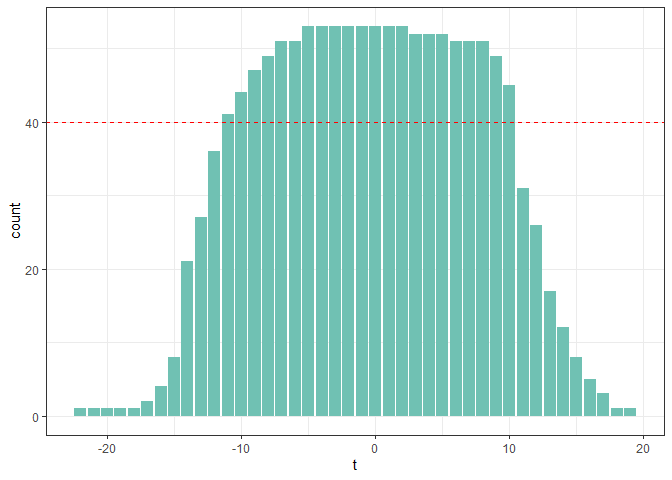
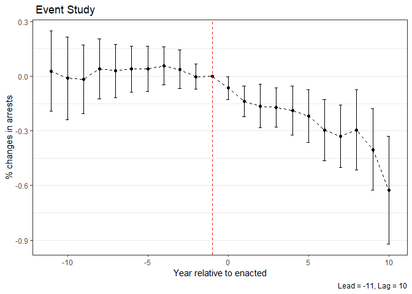
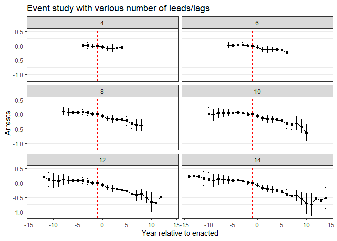
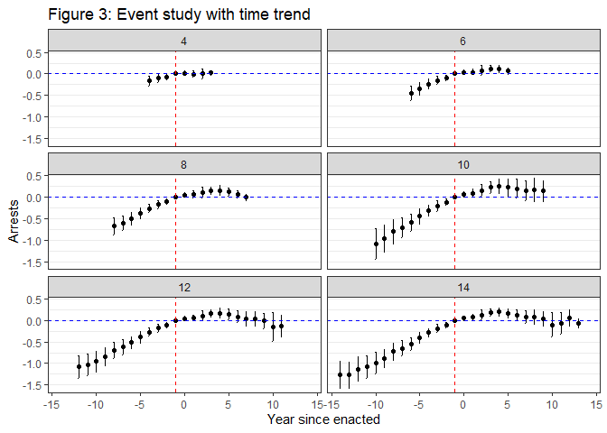

# 1 Juvenile curfew law

Brief introduction: This exercise would like to know how the enactment of juvenile curfew law affects the number of arrests of youth in panel of city, before and after the enactment.


```r
# Import data
curfew <- read_csv("./dataset/curfew.csv")
df2 = curfew %>% mutate(start = if_else(enacted == year, 1, 0))
```


## (a) bin up endpoints and preliminary event study

Step1: binning up the endpoints at t in which has more than 40 observations, ensuring having enough obervations at each t. That is, t = -11 and t = 10. 

Then, running the preliminary event study with this setup.


```r
# oberservations in each t

ggplot(data = df2) + geom_bar(aes(x = t), fill = "#70c1b3") + geom_hline(aes(yintercept = 40), 
    linetype = 2, color = "red") + theme_bw()
```



```r
df2 = df2 %>% filter(t >= -11 & t <= 10) %>% mutate(t = as.factor(t))
df2 = within(df2, t <- relevel(t, ref = 11))
model1 = felm(data = df2, lnarrests ~ t + as.factor(city) + as.factor(year) | 0 | 
    0 | city)
label = c(-11:10)[-11]
for (i in 1:length(label)) {
    label[i] = paste("t =", label[i])
}
stargazer(model1, type = "text", header = F, covariate.labels = label, omit = c(22:98))
```

```
## 
## ===============================================
##                         Dependent variable:    
##                     ---------------------------
##                              lnarrests         
## -----------------------------------------------
## t = -11                        0.028           
##                               (0.113)          
##                                                
## t = -10                       -0.012           
##                               (0.115)          
##                                                
## t = -9                        -0.018           
##                               (0.096)          
##                                                
## t = -8                         0.040           
##                               (0.084)          
##                                                
## t = -7                         0.030           
##                               (0.075)          
##                                                
## t = -6                         0.039           
##                               (0.064)          
##                                                
## t = -5                         0.040           
##                               (0.064)          
##                                                
## t = -4                         0.057           
##                               (0.053)          
##                                                
## t = -3                         0.038           
##                               (0.055)          
##                                                
## t = -2                        -0.003           
##                               (0.035)          
##                                                
## t = 0                        -0.065**          
##                               (0.032)          
##                                                
## t = 1                        -0.139***         
##                               (0.043)          
##                                                
## t = 2                        -0.163***         
##                               (0.061)          
##                                                
## t = 3                        -0.171***         
##                               (0.055)          
##                                                
## t = 4                        -0.188***         
##                               (0.069)          
##                                                
## t = 5                        -0.218***         
##                               (0.074)          
##                                                
## t = 6                        -0.297***         
##                               (0.086)          
##                                                
## t = 7                        -0.330***         
##                               (0.087)          
##                                                
## t = 8                        -0.295***         
##                               (0.113)          
##                                                
## t = 9                        -0.402***         
##                               (0.114)          
##                                                
## t = 10                       -0.625***         
##                               (0.151)          
##                                                
## -----------------------------------------------
## Observations                   1,094           
## R2                             0.826           
## Adjusted R2                    0.810           
## Residual Std. Error      0.347 (df = 997)      
## ===============================================
## Note:               *p<0.1; **p<0.05; ***p<0.01
```

This table shows that, compared to the year before the enactment of the law, the juvenile curfew law decreased siginificantly after the enforment of juvenile curfew. Also, this model is a fixed effect model, so it could be somehow interpret as the causal effect of curfew law.

## (b) Visualization


```r
# Extract the coefficients
coef_table = summary(model1)$coefficients
coef_table = (as.data.frame(coef_table) %>% mutate(x = row.names(coef_table)))[2:22, 
    ]
colnames(coef_table) = c("beta", "se", "t_value", "p_value", "event")

# build confident interval
coef_table = coef_table %>% mutate(lb = beta - 1.96 * se, ub = beta + 1.96 * se, 
    event = as.integer(str_remove(event, "t"))) %>% filter(event != -1) %>% rbind(c(0, 
    0, 0, 0, -1, 0, 0))

coef_table_c = coef_table
# for (e)
coef_table_c3 = coef_table

ggplot(data = coef_table_c, aes(x = event)) + geom_point(aes(y = beta)) + geom_line(aes(y = beta), 
    linetype = 2, size = 0.3) + geom_errorbar(aes(ymin = lb, ymax = ub), width = 0.2) + 
    geom_vline(aes(xintercept = -1), color = "red", linetype = "dashed") + theme_bw() + 
    labs(x = "Year relative to enacted", y = "% changes in arrests", caption = "Lead = -11, Lag = 10", 
        title = " Event Study") + theme(panel.grid.major.x = element_blank()) + theme(panel.grid.minor.x = element_blank())
```



At the first year when the law was enacte (t = 0), the effect seems not very significant because the confidence intervals includes 0. However, as the time goes on, the law becomes more effecetive. The lengths of confidence intervals also are affected by the number of samples and the effects are siginifciant in all periods from t = 5.


## (c) Try with more leads/lags

 


```r
upper_t = c(4, 6, 8, 10, 12, 14)
lower_t = -upper_t
total = upper_t - lower_t + 2
coef_table = coef_table %>% mutate(lead_lags = "c(-11,10)")
# replication of the last part
for (i in 1:length(upper_t)) {
    
    df2_less_more = curfew %>% mutate(start = if_else(enacted == year, 1, 0)) %>% 
        filter(t >= lower_t[i] & t <= upper_t[i]) %>% mutate(t = as.factor(t))
    
    df2_less_more = within(df2_less_more, t <- relevel(t, ref = upper_t[i]))
    
    model1_d = felm(data = df2_less_more, lnarrests ~ t + as.factor(year) + city | 
        0 | 0 | city)
    
    coef_table_d = summary(model1_d)$coefficients
    
    coef_table_d = (as.data.frame(coef_table_d) %>% mutate(x = row.names(coef_table_d)))[2:total[i], 
        ]
    
    colnames(coef_table_d) = c("beta", "se", "t_value", "p_value", "event")
    coef_table_d = coef_table_d %>% mutate(lb = beta - 1.96 * se, ub = beta + 1.96 * 
        se, event = as.integer(str_remove(event, "t"))) %>% rbind(c(0, 0, 0, 0, -1, 
        0, 0)) %>% mutate(leads_lags = upper_t[i])
    coef_table = coef_table %>% bind_rows(coef_table_d)
}

coef_table = coef_table %>% drop_na(leads_lags)

ggplot(data = coef_table, aes(x = event)) + geom_point(aes(y = beta)) + geom_errorbar(aes(ymin = lb, 
    ymax = ub), width = 0.1) + geom_line(aes(y = beta)) + geom_vline(aes(xintercept = -1), 
    color = "red", linetype = "dashed") + geom_hline(aes(yintercept = 0), color = "blue", 
    linetype = "dashed") + theme_bw() + labs(x = "Year relative to enacted", y = "Arrests", 
    title = "Event study with various number of leads/lags") + facet_wrap(~leads_lags, 
    ncol = 2) + theme(panel.grid.major.x = element_blank()) + theme(panel.grid.minor.x = element_blank())
```



The figure shows that the coefficients of the periods after t = -1  are affected downward a little bit when more leads/lags are added. Also, the effect also increases as time goes on. For example, the effect on t = 0 is pretty closed to 0. However, for t>=1, the effects become obvious. It could be explained as both people and officials need buffering time to adapting to the law. After they adapt to it, the effect of law would become effective over time. Also, there is no obvious trend before t=0, which could implicate there is no expected effect of the law.

## (d) Add specifict time trends


```r
total = total - 2

for (i in 1:length(upper_t)) {
    
    df2_less_more = curfew %>% mutate(start = if_else(enacted == year, 1, 0)) %>% 
        filter(t >= lower_t[i] & t <= upper_t[i]) %>% mutate(t = as.factor(t))
    
    df2_less_more = within(df2_less_more, t <- relevel(t, ref = upper_t[i]))
    
    model1_e = felm(data = df2_less_more, lnarrests ~ t + factor(city) * year | city | 
        0 | city)
    coef_table_e = summary(model1_e)$coefficients
    coef_table_e = (as.data.frame(coef_table_e) %>% mutate(x = row.names(coef_table_e)))[1:total[i], 
        ]
    colnames(coef_table_e) = c("beta", "se", "t_value", "p_value", "event")
    coef_table_e = coef_table_e %>% mutate(lb = beta - 1.96 * se, ub = beta + 1.96 * 
        se, event = as.integer(str_remove(event, "t"))) %>% rbind(c(0, 0, 0, 0, -1, 
        0, 0)) %>% mutate(leads_lags = upper_t[i])
    coef_table_c = coef_table_c %>% bind_rows(coef_table_e)
}

coef_table_c = coef_table_c %>% drop_na(leads_lags)

ggplot(data = coef_table_c, aes(x = event)) + geom_point(aes(y = beta)) + geom_errorbar(aes(ymin = lb, 
    ymax = ub), width = 0.1) + geom_point(aes(x = -1, y = 0)) + geom_vline(aes(xintercept = -1), 
    color = "red", linetype = "dashed") + geom_hline(aes(yintercept = 0), color = "blue", 
    linetype = "dashed") + theme_bw() + facet_wrap(~leads_lags, ncol = 2) + labs(x = "Year since enacted", 
    y = "Arrests", title = "Figure 3: Event study with time trend") + theme(panel.grid.major.x = element_blank()) + 
    theme(panel.grid.minor.x = element_blank())
```



This figure displays there is a rising trend of the coefficients. It means (1) There is an increasing trend before the enacted of the law and (2) after the law was enacted, juvenile crimes were still rising, but not that much. Add specific time trend is supposed to include the heterogeneous time effect among cities and ,however, the inclusion of specific time trends could lead to a wrong results. A better strategy is combines event study with propensity score matching.


## (e) Difference in difference model

In DID model, in order to make the model comparable to (b), I use the same observations and clustered error as in (b), which means I also drop the obersvations whose t<-11 or t>10.


```r
df2_g = curfew %>% mutate(treated = if_else(year >= enacted, 1, 0)) %>% filter(t >= 
    -11 & t <= 10)

model2_g = felm(data = df2_g, lnarrests ~ treated | city | 0 | city)
stargazer(model2_g, header = FALSE, type = "text")
```

```
## 
## ===============================================
##                         Dependent variable:    
##                     ---------------------------
##                              lnarrests         
## -----------------------------------------------
## treated                      -0.301***         
##                               (0.044)          
##                                                
## -----------------------------------------------
## Observations                   1,094           
## R2                             0.733           
## Adjusted R2                    0.720           
## Residual Std. Error      0.421 (df = 1040)     
## ===============================================
## Note:               *p<0.1; **p<0.05; ***p<0.01
```

```r
avg_event = data.frame(sum((coef_table_c3 %>% filter(event >= 0))$beta)/11)
rownames(avg_event) = "average coefficients of event study"
colnames(avg_event) = "value"
stargazer(avg_event, header = F, type = "text", summary = F)
```

```
## 
## ==========================================
##                                     value 
## ------------------------------------------
## average coefficients of event study -0.263
## ------------------------------------------
```

The estimates in DID model is -0.301, which is closed the average effects in the event study model (-0.263). There are two reasons why there is a gap between these two estimates. First, in DID, the effects are only be compared before and after the enacted of the law but, in event study, we think each year may affected heterogeneously by the law. Secondly, in event study, we compared each year relative to t = -1. On the other hand, we only compare before and after effect in DID.

# 2 Dynamic panel model

This exercise use the same datasets as the last one.

## (a) auto regression

The tale shows only the coefficient of lag_diff_y is significant. This model focuses on how the variation in last year affects the variation in this year. For example, we can find, in everage, one unit of change in the last year could lead to a -0.141 change in this year. Or, the change of status can also affect the varation in this year and next year by0.048 and 0.060 respectively. However, these results could be biased because of endogenity.


```r
df3 = curfew %>% mutate(treated = if_else(year >= enacted, 1, 0)) %>% arrange(city, 
    year) %>% mutate(lag_arrests = if_else(lag(year) < year, lag(lnarrests), as.numeric(0)), 
    dif_y = lnarrests - lag_arrests, lag_dif_y = if_else(lag(year) < year, lag(dif_y), 
        as.numeric(0)), dif_treated = if_else(lag(year) < year, treated - lag(treated), 
        as.numeric(999)), lag_dif_treated = if_else(lag(year) < year, lag(dif_treated), 
        as.numeric(999))) %>% filter(lag_dif_treated != 999) %>% drop_na(lag_dif_treated)

model3 = felm(dif_y ~ lag_dif_y + dif_treated + lag_dif_treated | year | 0 | 0, data = df3)
stargazer(model3, header = F, type = "text")
```

```
## 
## ===============================================
##                         Dependent variable:    
##                     ---------------------------
##                                dif_y           
## -----------------------------------------------
## lag_dif_y                    -0.141***         
##                               (0.028)          
##                                                
## dif_treated                   -0.048           
##                               (0.041)          
##                                                
## lag_dif_treated               -0.060           
##                               (0.041)          
##                                                
## -----------------------------------------------
## Observations                   1,188           
## R2                             0.097           
## Adjusted R2                    0.077           
## Residual Std. Error      0.277 (df = 1162)     
## ===============================================
## Note:               *p<0.1; **p<0.05; ***p<0.01
```


## (b)Use instrument variables as lag variables


```r
df3_b = df3 %>% mutate(lag2_y = if_else(lag(year) < year, lag(lag_arrests), as.numeric(0)), 
    lag2_dif_y = if_else(lag(year) < year, lag(lag_dif_y), as.numeric(0))) %>% filter(lag2_dif_y != 
    0) %>% drop_na(lag2_y)

instru_lag2 = felm(dif_y ~ dif_treated + lag_dif_treated | year | (lag_dif_y ~ lag2_y), 
    data = df3_b)


instru_dif_lag2 = felm(dif_y ~ dif_treated + lag_dif_treated | year | (lag_dif_y ~ 
    lag2_dif_y) | 0, data = df3_b)

instru_both = felm(dif_y ~ dif_treated + lag_dif_treated | year | (lag_dif_y ~ lag2_dif_y + 
    lag2_y) | 0, data = df3_b)

stargazer(instru_lag2, instru_dif_lag2, instru_both, type = "text", header = F, omit = c(5:25))
```

```
## 
## =============================================================
##                                      Dependent variable:     
##                                 -----------------------------
##                                             dif_y            
##                                    (1)        (2)      (3)   
## -------------------------------------------------------------
## dif_treated                       -0.065    -0.060    -0.062 
##                                  (0.047)    (0.043)  (0.044) 
##                                                              
## lag_dif_treated                   -0.027    -0.036    -0.033 
##                                  (0.048)    (0.043)  (0.044) 
##                                                              
## `lag_dif_y(fit)`                 0.584***   0.375**  0.447***
##                                  (0.213)    (0.151)  (0.135) 
##                                                              
## -------------------------------------------------------------
## Observations                      1,133      1,133    1,133  
## R2                                -0.295    -0.078    -0.143 
## Adjusted R2                       -0.323    -0.101    -0.167 
## Residual Std. Error (df = 1108)   0.315      0.288    0.296  
## =============================================================
## Note:                             *p<0.1; **p<0.05; ***p<0.01
```

After instumenting 2 periods lag variables, the coefficient of lag_diff_y becomes positive.  

## (c) Sargan test

P-value of sargan test is 0.345, which implicate we cannot reject the hypothesis. Therefore,we know there is a overidentification problem if we use both instruments.


```r
over_ident = as.data.frame(sargan(instru_both))
stargazer(over_ident, type = "text", header = FALSE, title = "sargan test")
```

```
## 
## sargan test
## ==================================================================
## Statistic           N Mean  St. Dev.  Min  Pctl(25) Pctl(75)  Max 
## ------------------------------------------------------------------
## sargan(instru_both) 1 0.892          0.892  0.892    0.892   0.892
## ------------------------------------------------------------------
```

## (d) Compare event study and dynamic panel

In my opinion, I think event study model is more convincing than the dynamic model. First, I don't think lag variables could be  used as instruments and they are not exogeneous. Also, it's difficult to interpret the evolution of juvenily curfew law using dynamce panel model.


